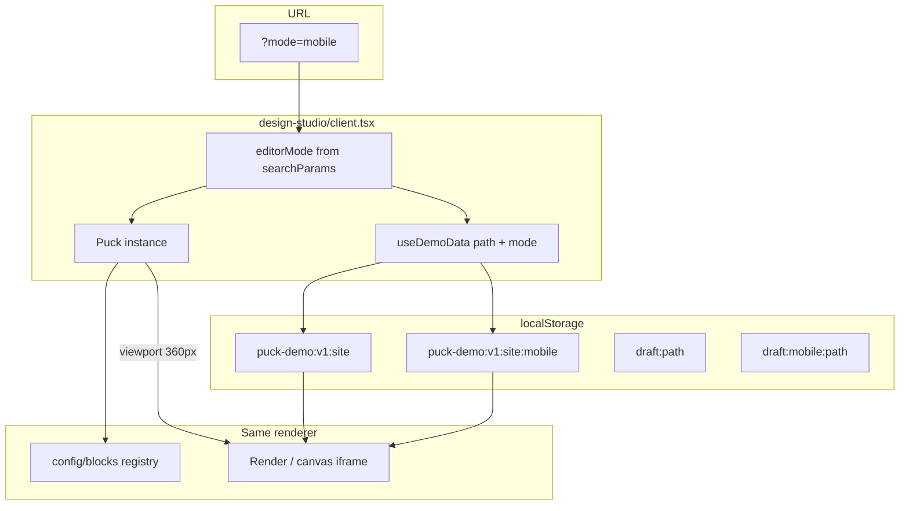

# Mobile Editor — Architecture Plan

> **Goal:** A second editor instance on the same Design Studio page (`?mode=mobile`)
> that edits a **separate Site JSON** (different localStorage key), renders through
> the **same block registry + `<Render>`**, and locks the canvas to a **mobile
> viewport** so mobile-specific props (`columnsMobile`, `hideOnMobile`,
> `is_mobile_only`, …) are editable and visible in context.
>
> **Status:** Phases M1–M4 complete (2026-07-14).
> **Related:** `docs/builder-roadmap.md` (deferred backlog item),
> `packages/editor-packages/CLAUDE.md` § "second Site JSON instance".

---

## 0. TL;DR — two layers of "mobile"

Today the codebase already has **responsive props inside one JSON tree**:

| Prop | Where | Render behaviour |
|---|---|---|
| `columnsMobile` | `Section` | CSS `@media (max-width: 768px)` overrides grid columns |
| `layout.hideOnMobile` | any `withLayout` block | Hidden at mobile breakpoint (editor + storefront CSS) |
| `is_mobile_only` | shell zone blocks | Hidden on desktop via `zone-responsive.module.css` |
| `showOnMobile` | Sidebar, SideDrawer, SiteDrawerShell | Per-block mobile visibility |

What is **missing** is the **mobile builder instance** itself:

1. Separate persisted Site JSON (`puck-demo:v1:site:mobile`)
2. Query-param mode switch (`?mode=mobile`)
3. Canvas locked to ~360px
4. Properties panel that surfaces mobile fields (e.g. `columnsMobile` — removed from desktop panel in redesign checkpoint 1, intentionally deferred here)
5. Storefront/preview path that reads the mobile site on mobile devices

Both layers coexist: the mobile editor can edit responsive overrides **and** maintain an independent page/zone tree if you seed a full copy.

---

## 1. Target UX

```
/store/{slug}/design-studio/theme-1/edit          ← desktop editor (default)
/store/{slug}/design-studio/theme-1/edit?mode=mobile   ← mobile editor
```

| Element | Desktop mode | Mobile mode (`?mode=mobile`) |
|---|---|---|
| Storage key | `puck-demo:v1:site` | `puck-demo:v1:site:mobile` |
| Canvas width | User picks (360/768/1280/full) | Locked to **360px** (or theme `breakpointMobileMax`) |
| Viewport switcher | Visible | Hidden or mobile-only |
| Properties panel | Desktop fields | **+ mobile fields** (`columnsMobile`, hide flags, `is_mobile_only`) |
| Pages list | Same routes | Same routes (content per page is mode-specific) |
| Publish | Writes desktop key | Writes mobile key |
| Preview | Desktop site | `?mode=mobile` on preview route |
| Header chrome | "Desktop" active | Toggle: **سطح المكتب | الجوال** |

---

## 2. Data model

### 2.1 Separate `SiteData` blob (recommended)

```typescript
// site-data.ts
export type EditorMode = "desktop" | "mobile";

export function getSiteStorageKey(mode: EditorMode = "desktop") {
  return mode === "mobile"
    ? `puck-demo:${componentKey}:site:mobile`
    : `puck-demo:${componentKey}:site`;
}
```

`SiteData` shape is **identical** — `{ root, zones, pages[] }`. No schema change.

### 2.2 First-open seeding

When `readSiteData("mobile")` finds no payload:

```typescript
function seedMobileSiteFromDesktop(): SiteData {
  const desktop = readSiteData("desktop");
  return structuredClone(desktop); // deep copy as starting point
}
```

Merchant then customizes mobile layout independently. Alternative (stricter): start empty pages and force explicit build — worse UX.

### 2.3 Shared vs duplicated `root` theme

| Option | Pros | Cons |
|---|---|---|
| **A — fully independent** (copy includes root) | Simple; mobile can override fonts/colors | Two sources of truth for brand |
| **B — shared root, separate pages/zones** | One theme; only layout differs | More complex read/write merge |

**Recommendation:** Phase 1 = **A** (full copy, simplest). Phase 2 = optional "sync theme from desktop" button in settings.

### 2.4 Draft autosave

Extend `page-draft.ts`:

```typescript
getDraftStorageKey(path, mode) =>
  mode === "mobile"
    ? `puck-demo:v1:draft:mobile:${path}`
    : `puck-demo:v1:draft:${path}`;
```

---

## 3. What needs to change (by layer)

### 3.1 Site data layer — `config/lib/site-data.ts`

- [ ] `getSiteStorageKey(mode)`
- [ ] `readSiteData(mode)`, `writeSiteData(site, mode)`
- [ ] `applyPuckSave(site, path, puckData, mode)`
- [ ] `getSiteSnapshot(mode)` for JSON viewer
- [ ] Legacy key migration (adopt `puck-demo:*:site:mobile` if present)
- [ ] `seedMobileSiteFromDesktop()` on first mobile read
- [ ] Tests: round-trip, seed, composePuckData, idempotence (mirror `site-data-fixtures.spec.ts`)

### 3.2 Draft layer — `config/lib/page-draft.ts`

- [ ] `getDraftStorageKey(path, mode)`
- [ ] `readPageDraft` / `writePageDraft` / `clearPageDraft` accept `mode`

### 3.3 Design Studio host — `apps/web/.../design-studio/[...puckPath]/client.tsx`

- [ ] Read `mode` from `useSearchParams()` → `editorMode: "desktop" | "mobile"`
- [ ] Pass `mode` into `useDemoData({ path, mode, isEdit })`
- [ ] Puck `key={`${path}:${mode}:${draftEpoch}`}` — remount on mode switch
- [ ] `getSiteSnapshot` / `handleOpenPreview` / export JSON — mode-aware
- [ ] Header toggle (Desktop ↔ Mobile) — preserves path, flips `?mode=mobile`
- [ ] Visual badge when in mobile mode (e.g. "محرر الجوال")
- [ ] Pass `metadata={{ ...EDITOR_METADATA, editorMode: mode }}` (stable ref per mode)

### 3.4 Data hook — `apps/web/lib/use-demo-data.ts`

- [ ] Accept `mode` param
- [ ] `useMemo` depends on `getSiteStorageKey(mode)`
- [ ] `savePageData` writes to correct site blob
- [ ] Listen for cross-tab `storage` events on mobile key too

### 3.5 Puck viewport — canvas sizing

Puck already has viewport infrastructure (`state.ui.viewports`, `ViewportControls`, `defaultViewports`).

When `mode=mobile`:

```typescript
const mobileViewports = [
  { width: 360, height: "auto", icon: "Smartphone", label: "جوال" },
];

<Puck
  viewports={mode === "mobile" ? mobileViewports : undefined}
  ui={{
    viewports: {
      current: { width: 360, height: "auto" },
      controlsVisible: false, // hide switcher
    },
  }}
/>
```

**Also check:** `Canvas/index.tsx` auto-selects viewport from `window.innerWidth` on load — must not override the forced mobile viewport when `mode=mobile`. Pass `ui.viewports.current` via `ui` prop so the guard `if (uiProp?.viewports?.current) return` kicks in.

### 3.6 Editor mode context — new

```typescript
// config/lib/editor-mode.ts
export type EditorMode = "desktop" | "mobile";
export const EditorModeContext = createContext<EditorMode>("desktop");
export const useEditorMode = () => useContext(EditorModeContext);
```

Provide from `client.tsx` overrides.puck wrapper. Blocks and custom fields read it without importing from apps/web.

### 3.7 Properties panel — mobile-only fields

Fields deliberately deferred to mobile builder (see `editor-redesign-checkpoint-1.md`):

| Block | Field | Action in mobile mode |
|---|---|---|
| `Section` | `columnsMobile` | Re-add `createColumnsField({ label: "أعمدة الجوال" })` in التخطيط tab |
| `Layout` plugin | `hideOnMobile`, `hideOnTablet`, `hideOnDesktop` | Show visibility toggles prominently |
| Zone blocks | `is_mobile_only` | Surface in المحتوى or متقدم |
| `Sidebar` | `showOnMobile` | Already exists — ensure visible |
| `SideDrawer` / `SiteDrawerShell` | `showOnMobile` | Same |

Implementation options:

1. **Property plugin `resolveFields`** checks `params.metadata.editorMode` or `useEditorMode()`
2. **Conditional field registration** in `createBlock` per mode — heavier
3. **Shared `mobileFieldsPlugin()`** that blocks opt into

**Recommendation:** `resolveFields` + `useEditorMode()` in custom fields. Section migration:

```typescript
resolveFields: (data, params) => {
  const fields = baseFields;
  if (params.metadata.editorMode === "mobile") {
    return { ...fields, columnsMobile: createColumnsField({ label: "أعمدة الجوال" }) };
  }
  return fields;
}
```

### 3.8 Block rendering — already mostly ready

| Concern | Current state | Gap |
|---|---|---|
| `Layout` hide flags | Reads `viewports.current.width` → `getViewportBucket()` | Works when canvas is 360px ✓ |
| `Section.columnsMobile` | CSS media query at 768px | Hardcoded breakpoint — should use `root.props.breakpointMobileMax` |
| Zone `is_mobile_only` | `zone-responsive.module.css` | Works on storefront ✓ |
| Editor suppresses hide | `puckIsEditing` keeps hidden blocks visible | Works ✓ |

**Fix:** Section media query `@media (max-width: 768px)` → theme breakpoint from root props.

### 3.9 Storefront — `apps/store`

Today: `use-storefront-data.ts` always reads `getSiteStorageKey()` (desktop).

- [ ] Detect viewport (CSS/`window.matchMedia`) or honour `?mode=mobile` in preview
- [ ] `getSiteStorageKey(mode)` — mobile device → mobile site if exists, else fallback desktop
- [ ] `composePuckData(mobileSite, path)` on mobile
- [ ] Preview route passes mode through

```typescript
function resolveStorefrontMode(): EditorMode {
  if (typeof window === "undefined") return "desktop";
  if (new URLSearchParams(window.location.search).get("mode") === "mobile") return "mobile";
  const bp = readSiteData("desktop").root.props?.breakpointMobileMax ?? 767;
  return window.matchMedia(`(max-width: ${bp}px)`).matches ? "mobile" : "desktop";
}
```

### 3.10 Preview flow

- [ ] `buildStudioPreviewHref` appends `?mode=mobile` when editing mobile
- [ ] `PreviewPageShell` shows "معاينة الجوال" badge
- [ ] `apps/store` preview/dev route reads mobile key

### 3.11 Plugins — behaviour in mobile mode

| Plugin | Change needed |
|---|---|
| `pages` | Same page list; `readSiteData(mode)` for per-page content |
| `zones` | Mobile site has its own `zones` — independent shell |
| `settings` | Phase 1: edits mobile site's `root` (duplicate). Phase 2: "sync theme" action |
| `shopify-editor` (outline) | Reads current mode's site data |
| `themes` | Theme gallery applies to which site? → desktop only, or both with confirm |
| `canvas-interactions` | No change |
| Block palette | Optionally highlight `is_mobile_only`-friendly blocks |

### 3.12 JSON viewer / export

- [ ] Label: "Site data (mobile)" vs "Site data (desktop)"
- [ ] Export filename: `site-mobile.json` vs `site.json`
- [ ] Copy documents which mode is shown

---

## 4. Architecture diagram



---

## 5. Phased implementation

### Phase M1 — Skeleton (1–2 days)

1. `getSiteStorageKey(mode)` + read/write/applyPuckSave
2. `useDemoData({ mode })` + client.tsx `?mode=mobile` + header toggle
3. Force mobile viewport on Puck
4. Seed mobile site from desktop on first open
5. Tests for storage keys + seed

**Exit:** Toggle modes, edit independently, publish to separate keys, canvas shows 360px.

### Phase M2 — Mobile properties (1–2 days)

1. `EditorModeContext` + `metadata.editorMode`
2. Re-add `columnsMobile` field in Section when `mode=mobile`
3. Layout visibility fields surfaced in mobile mode
4. Zone `is_mobile_only` prominent in panel
5. Fix Section breakpoint to use theme token

**Exit:** Merchant can set mobile columns and hide flags while seeing correct canvas.

### Phase M3 — Storefront + preview (1 day)

1. `apps/store` reads mobile site on narrow viewports
2. Preview preserves `?mode=mobile`
3. Fallback: no mobile site → desktop site

**Exit:** Published mobile JSON renders on phone; preview matches.

### Phase M4 — Polish (complete)

1. **مزامنة** dropdown in mobile editor header:
   - نسخ الصفحة من سطح المكتب (`syncMobilePageFromDesktop`)
   - مزامنة المظهر من سطح المكتب (`syncMobileThemeFromDesktop`)
   - إعادة تعيين موقع الجوال (`resetMobileSiteFromDesktop`)
2. Zone / shell blocks surface `is_mobile_only` and `showOnMobile` in المحتوى / التخطيط tabs via `applyMobileEditorFieldGroups`
3. `useDemoData({ revision })` re-reads storage after sync actions

**Exit:** Merchant can recover from drift without manually re-seeding; mobile-only flags are easy to find in the properties panel.

### Phase M5 — Backlog

- Side-by-side desktop/mobile preview
- Backend persistence (`store_config_mobile` field)
- Mobile-specific block palette category

---

## 6. Decisions to lock before coding

| # | Question | Recommendation |
|---|---|---|
| 1 | Separate full SiteData or responsive-only (same tree)? | **Separate full SiteData** — matches "another instance" |
| 2 | Seed mobile from desktop on first open? | **Yes** — copy desktop snapshot |
| 3 | Shared or duplicate root theme? | **Duplicate** in M1; sync button later |
| 4 | Can mobile page tree differ structurally (add/remove sections)? | **Yes** — independent `pages[].content` |
| 5 | Storefront: mobile site mandatory or fallback? | **Fallback to desktop** if mobile key empty |
| 6 | Single Puck mount or two side-by-side? | **Single mount, mode switch** (query param remounts via `key`) |

---

## 7. Files touched (checklist)

| File | Change |
|---|---|
| `config/lib/site-data.ts` | Mode-aware storage |
| `config/lib/page-draft.ts` | Mode-aware drafts |
| `config/lib/editor-mode.ts` | **New** — context + hook |
| `apps/web/lib/use-demo-data.ts` | `mode` param |
| `apps/web/.../client.tsx` | Query param, toggle, viewport, metadata |
| `apps/web/lib/design-studio-paths.ts` | Preserve `mode` in hrefs |
| `config/blocks/Section/index.tsx` | `columnsMobile` field in mobile mode |
| `config/property-plugins/layout.tsx` | Visibility fields in mobile mode |
| `config/fields/ColumnsField/index.tsx` | Already built — wire up |
| `apps/store/lib/use-storefront-data.ts` | Mobile site selection |
| `apps/store/.../page.tsx` | Pass mode if needed |
| `config/lib/mobile-sync.ts` | **New** — page/theme/reset sync helpers |
| `config/lib/mobile-field-groups.ts` | **New** — mobile field tab grouping |
| `apps/web/lib/use-demo-data.ts` | `revision` param for storage refresh |
| `apps/web/.../client.tsx` | Sync dropdown in mobile header |
| `config/blocks/SiteHeader/index.tsx` | `resolveFields` for mobile groups |
| `config/blocks/SiteFooter/index.tsx` | `resolveFields` for mobile groups |
| `config/blocks/ZoneDrawer/index.tsx` | `resolveFields` for mobile groups |
| `config/blocks/Sidebar/index.tsx` | `resolveFields` for `showOnMobile` |
| `config/blocks/SideDrawer/index.tsx` | `resolveFields` for `showOnMobile` |
| `config/lib/__tests__/mobile-sync.spec.ts` | Sync helper tests |
| `config/lib/__tests__/mobile-field-groups.spec.ts` | Field grouping tests |

**No change needed (already compatible):**

- Block registry (`config/index.tsx`) — same blocks
- `Layout.client.tsx` — viewport bucket from canvas width
- `zone-responsive.module.css` — `is_mobile_only`
- `data-adapter/` — mode-agnostic (C2 checkpoint prepared for mobile builder)
- Property plugins architecture — extend with `mobileFieldsPlugin` later

---

## 8. Risks & mitigations

| Risk | Mitigation |
|---|---|
| Two sites drift apart (merchant confusion) | Seed from desktop; "reset from desktop" action; clear UI badge |
| Double localStorage size | Acceptable for dev; backend stores one blob per mode |
| Puck remount on mode switch loses undo | Expected — same as page switch today; draft autosave per mode |
| Theme edited in mobile doesn't match desktop | Phase 2 sync button; settings panel warning |
| `columnsMobile` uses 768px but theme says 767px | Unify on `breakpointMobileMax` |
| Performance: two full Puck trees | **Don't** mount both — query param switches one instance |

---

## 9. What you do NOT need to change

- **Block render functions** — already responsive via CSS + viewport bucket
- **SiteData schema** — same shape, different storage key
- **Binding layer** — `EditorDataAdapter` is mode-agnostic (Phase C2)
- **Property plugins refactor** — orthogonal; mobile fields plug into `resolveFields`
- **Backend API** — defer until localStorage flow is proven (add `mobileSiteConfig` field later)

---

*Last updated: 2026-07-14*
