# Puck Blocks — Reference Documentation

Each block is described with its **properties**, accepted **values**, and a ready-to-use **JSON example** (the exact shape stored in `store_config.json`).

> **Sibling doc:** [BLOCKS-MOBILE.md](./BLOCKS-MOBILE.md) documents the mobile-only subset of this
> registry. Zones (header / footer / drawer / popup / bottom sheet) live in [ZONES.md](./ZONES.md).

> **Common note — `layout`**  
> Most blocks wrap their props with a `WithLayout` higher-order type that adds a shared `layout` object. The `layout` prop controls advanced positioning (padding, border, shadow, float placement, per-breakpoint visibility via `hideOnMobile` / `hideOnTablet` / `hideOnDesktop`, etc.). It is omitted from the examples below for brevity; add it only when you need non-default positioning. See [Layout (`layout` prop)](#layout-layout-prop).

> **Common note — `showCondition`**  
> **Every** registered block also carries a `showCondition` prop, injected by `withShowCondition()`
> (`config/lib/with-show-condition.tsx`). Values: `"always"` (default) / `"loggedIn"` / `"loggedOut"`.
> It is evaluated against the customer session at render time and always renders in the editor.
> See [showCondition](#showcondition).

> **Common note — bilingual text (`{ ar, en }`)**  
> Most user-visible text props are **`BilingualString`** objects, not plain strings. The registry of
> which prop on which block is bilingual is `config/lib/bilingual-props.ts`. Legacy plain strings and
> legacy `*Ar` siblings still load (they are migrated on read). See
> [Bilingual text](#bilingual-text-bilingualstring) for the full contract and the per-block table.

---

## Block status — what to use, what to avoid

Source of truth: the single registry in [`config/index.tsx`](../index.tsx). Status legend:

| Status | Meaning |
|---|---|
| ✅ **Active** | Shown in the blocks palette. Use these. |
| 🧩 **Preset-only** | Registered and rendered, but **hidden from the palette** — inserted only by section/zone presets and built-in themes. Don't hand-place; edit through the preset. |
| ⛔ **IGNORED** | Registered so old `store_config.json` keeps rendering, but **do not use in new work**. Not in the palette, not in any preset or shipped theme. Treat as scheduled for deletion. |
| 🗄️ **Legacy** | Superseded by a documented replacement; kept render-only for old payloads. **Do not use.** |
| ❌ **Removed** | No longer registered at all. Old JSON referencing it renders nothing. |

### ✅ Active — the palette (`categories` in `config/index.tsx`)

| Category (Arabic label) | Blocks |
|---|---|
| `layout` — **تخطيط** | [`Section`](#section), [`Group`](#group), [`RowGroup`](#rowgroup) |
| `blocks` — **عناصر** | [`ContentHeading`](#contentheading), [`ContentParagraph`](#contentparagraph), [`ContentImage`](#contentimage), [`ContentButton`](#contentbutton), [`Chip`](#chip), [`ButtonGroup`](#buttongroup), [`ContentLink`](#contentlink), [`ContentInput`](#contentinput), [`ContentSwitch`](#contentswitch), [`ContentDropdown`](#contentdropdown), [`ContentMap`](#contentmap), [`ContentDivider`](#contentdivider), [`Space`](#space), [`ImageGallery`](#imagegallery), [`VideoEmbed`](#videoembed), [`Accordion`](#accordion) |

Site zones (`SiteHeader`, `SiteFooter`, `ZoneDrawer`, `ZonePopup`, `ZoneBottomSheet`) are also active,
but managed through the **المناطق** sidebar plugin instead of the palette, and carry fixed permissions
`{ insert: false, duplicate: false, drag: false, delete: false }`. See [ZONES.md](./ZONES.md).

### 🧩 Preset-only — hidden, but still used

| Block | Used by |
|---|---|
| [`NavMenu`](#navmenu) | `presets/zone-shell.ts`, `presets/drawer.ts`, all shipped themes |
| [`Card`](#card) | `presets/general.ts` (`three-feature-cards`), `theme-sooq-modern`, `theme-meridian-almarai` |
| [`ContentIcon`](#contenticon) | `theme-sooq-modern`, `theme-meridian-almarai` |
| [`Hero`](#hero) | `presets/shared.ts` (legacy hero body; new hero presets are `Section`-based) |
| [`Stats`](#stats) | `theme-sooq-modern` |
| [`ProductImageCarousel`](#productimagecarousel), [`ProductVariants`](#productvariants) | `theme-meridian-almarai` product-detail page |
| [`Testimonials`](#testimonials) | `theme-meridian-almarai` |

> These are listed in the hidden `legacy` category in `config/index.tsx` even though presets still emit
> them. Removing one means editing the presets/themes above first.

### ⛔ IGNORED — do not use (registered for old JSON only)

| Block | Why it's ignored |
|---|---|
| [`CategoryListMenu`](#categorylistmenu), [`CheckoutForm`](#checkoutform), [`ProductSearchMenu`](#productsearchmenu), [`OrderHistory`](#orderhistory), [`Wishlist`](#wishlist), [`ContactForm`](#contactform) | In the `storeBlocks` category, which is `visible: false` **with every entry commented out** — the explicit "IGNORED" marker in `config/index.tsx` |
| [`ContentHtml`](#contenthtml), [`SideDrawer`](#sidedrawer), [`Template`](#template), [`Logos`](#logos) | Listed in the hidden `legacy` category and emitted by **no** preset or shipped theme |
| [`Sidebar`](#sidebar) | Registered in `components` but listed in **no** category at all, so it lands in the hidden `other` bucket |
| [`Blank`](#blank) | Never registered — dev-only placeholder |

Do not re-enable one without also wiring it into a preset or theme (and updating this doc).

### 🗄️ Legacy — superseded, use the replacement

| Legacy block | Use instead |
|---|---|
| [`CartSection`](#cartsection), [`CartList`](#cartlist), [`CartItem`](#cartitem), [`CartQuantity`](#cartquantity) | `Section` with `metadata.preset: "shopping-cart"` + `Group` with `cartLineId` |
| [`ProductCard`](#productcard) | `Group` with a `product` picker (Products Grid preset) |
| [`ProductImage`](#productimage), [`ProductInfo`](#productinfo) | Bound `Group` + `ContentImage` / `ContentHeading` with `valueContext` |
| [`CartIconButton`](#carticonbutton), [`OrdersIconButton`](#ordersiconbutton) | `ContentButton` presets (`CART_ICON_BUTTON` / `ORDERS_ICON_BUTTON` in `presets/zone-shell.ts`) |
| [`SiteDrawerShell`](#sitedrawershell) | [`ZoneDrawer`](#zonedrawer) |
| [`Heading`](#heading), [`Text`](#text), [`RichText`](#richtext) | [`ContentHeading`](#contentheading) / [`ContentParagraph`](#contentparagraph) |
| [`Button`](#button) | [`ContentButton`](#contentbutton) |
| [`Grid`](#grid), [`Flex`](#flex) | `Section` columns, [`Group`](#group), [`RowGroup`](#rowgroup) |

### ❌ Removed

- **`ProductsGrid`** — deleted from the registry. Use `Section` with `metadata.preset: "products-grid"`.
  Documented [below](#productsgrid) only so old payloads can be read.
- There is **no** `LoginButton`, `CartButton`, or `MyOrdersButton` block — use `ContentButton`
  with the presets in `config/presets/zone-shell.ts` / `config/presets/header-layouts.ts`.

---
> **Block registry** (`config/index.tsx`)  
> Blocks registered in the editor are grouped as:
> - **layout** — `Section`, `Group`, `RowGroup`
> - **blocks** — `ContentHeading`, `ContentParagraph`, `ContentImage`, `ContentButton`, `Chip`, `ButtonGroup`, `ContentLink`, `ContentInput`, `ContentSwitch`, `ContentSelect`, `ContentDivider`, `Space`, `ImageGallery`, `VideoEmbed`, `Accordion`
> - **storeBlocks** — currently `Testimonials` is the only entry surfaced in the palette; `ProductImageCarousel`, `ProductVariants`, `CategoryListMenu`, `CheckoutForm`, `ProductSearchMenu`, `OrderHistory`, `Wishlist`, `ContactForm` are all registered but commented out of the visible palette (used inside presets or bound `Group` slots). Header cart / orders use `ContentButton` presets — legacy `CartIconButton` / `OrdersIconButton` are in **legacy**.
> - **legacy** — hidden from picker; still resolvable so old `store_config.json` payloads render
>
> **Site zones** (`SiteHeader`, `SiteFooter`, `ZoneDrawer`, `ZonePopup`, `ZoneBottomSheet`, plus the legacy `SiteDrawerShell`) are managed via the **المناطق** sidebar plugin — not the blocks palette. They also carry fixed permissions `{ insert: false, duplicate: false, drag: false, delete: false }`. See [ZONES.md](./ZONES.md).
>
> **Legacy blocks** (registered but hidden from the picker; kept so old `store_config.json` still loads): `CartSection`, `CartList`, `CartItem`, `CartQuantity`, `CartIconButton`, `OrdersIconButton`, `ProductCard`, `SiteDrawerShell`, `SideDrawer`, `Heading`, `Text`, `RichText`, `Button`, `Card`, `Grid`, `Flex`, `Hero`, `Logos`, `Stats`, `Template`, `NavMenu`, `ContentIcon`, `ContentHtml`, `ProductImage`, `ProductInfo`. `ProductsGrid` is fully removed — replaced by the Products Grid section preset.

> **Runtime metadata & data binding**  
> Commerce sections use **`Group`** blocks as binding roots — not standalone `ProductCard` / `ProductsGrid` blocks. When a product is picked on a Group, the editor auto-populates read-only `metadata` with `apiUrl`. Child blocks (`ContentHeading`, `ContentParagraph`, `ContentImage`, `ContentButton`) resolve live values via optional `valueContext.path` against the Group's bound data. Mobile converters should fetch from `metadata.apiUrl` at render time rather than embedding product payloads in JSON.
>
> **Commerce section presets (preferred)**  
> Insert via Design Studio → **Products Grid**, **Products Page**, **Shopping Cart**, or **Account** section presets. All are `Section` blocks with `metadata.preset` set — see [Section preset metadata](#section-preset-metadata).

---

## Table of Contents

Status tags mirror the [block status matrix](#block-status--what-to-use-what-to-avoid):
✅ active · 🧩 preset-only · ⛔ ignored · 🗄️ legacy · ❌ removed.

1. [Accordion](#accordion) ✅
2. [Blank](#blank) ⛔
3. [Button](#button) 🗄️
4. [ButtonGroup](#buttongroup) ✅
5. [CartIconButton](#carticonbutton) 🗄️
6. [CartItem](#cartitem) 🗄️
7. [CartList](#cartlist) 🗄️
8. [CartQuantity](#cartquantity) 🗄️
9. [CartSection](#cartsection) 🗄️
10. [Card](#card) 🧩
11. [CategoryListMenu](#categorylistmenu) ⛔
12. [CheckoutForm](#checkoutform) ⛔
13. [Chip](#chip) ✅
14. [ContactForm](#contactform) ⛔
15. [ContentButton](#contentbutton) ✅
16. [ContentDivider](#contentdivider) ✅
17. [ContentDropdown](#contentdropdown) ✅
18. [ContentHeading](#contentheading) ✅
19. [ContentHtml](#contenthtml) ⛔
20. [ContentIcon](#contenticon) 🧩
21. [ContentImage](#contentimage) ✅
22. [ContentInput](#contentinput) ✅
23. [ContentLink](#contentlink) ✅
24. [ContentMap](#contentmap) ✅
25. [ContentParagraph](#contentparagraph) ✅
26. [ContentSelect](#contentselect) ✅
27. [ContentSwitch](#contentswitch) ✅
28. [Flex](#flex) 🗄️
29. [Grid](#grid) 🗄️
30. [Group](#group) ✅
31. [Heading](#heading) 🗄️
32. [Hero](#hero) 🧩
33. [ImageGallery](#imagegallery) ✅
34. [Logos](#logos) ⛔
35. [NavMenu](#navmenu) 🧩
36. [OrderHistory](#orderhistory) ⛔
37. [OrdersIconButton](#ordersiconbutton) 🗄️
38. [ProductCard](#productcard) 🗄️
39. [ProductImage](#productimage) 🗄️
40. [ProductImageCarousel](#productimagecarousel) 🧩
41. [ProductInfo](#productinfo) 🗄️
42. [ProductSearchMenu](#productsearchmenu) ⛔
43. [ProductVariants](#productvariants) 🧩
44. [ProductsGrid](#productsgrid) ❌
45. [RichText](#richtext) 🗄️
46. [RowGroup](#rowgroup) ✅
47. [Section](#section) ✅
48. [Sidebar](#sidebar) ⛔
49. [SideDrawer](#sidedrawer) ⛔
50. [SiteDrawerShell](#sitedrawershell) 🗄️
51. [SiteFooter](#sitefooter) ✅ *(zone)*
52. [SiteHeader](#siteheader) ✅ *(zone)*
53. [Space](#space) ✅
54. [Stats](#stats) 🧩
55. [Template](#template) ⛔
56. [Testimonials](#testimonials) 🧩
57. [Text](#text) 🗄️
58. [VideoEmbed](#videoembed) ✅
59. [Wishlist](#wishlist) ⛔
60. [ZoneBottomSheet](#zonebottomsheet) ✅ *(zone)*
61. [ZoneDrawer](#zonedrawer) ✅ *(zone)*
62. [ZonePopup](#zonepopup) ✅ *(zone)*

**Site-wide reference sections**

- [Site JSON (`SiteData`)](#site-json-sitedata)
- [Pages (`SitePage`)](#pages-sitepage)
- [Theme root props (`FullThemeProps`)](#theme-root-props-fullthemeprops)
- [Section preset catalog](#section-preset-catalog)
- [Products page filters](#products-page-filters)
- [Shared concepts (bilingual text, data binding, LinkValue, showCondition, tokens…)](#shared-concepts)

---

## Accordion

**Label:** أكورديون  
**Description:** Collapsible FAQ / accordion list with a heading, description, and expandable items.

### Properties

| Property | Type | Values / Notes | Default |
|---|---|---|---|
| `heading` | **`BilingualString`** | Section heading | `{ ar: "الأسئلة الشائعة", en: "FAQ" }` |
| `description` | **`BilingualString`** | Subtitle below heading | `{ ar: "إجابات مختصرة وعملية…", en: "Short, practical answers…" }` |
| `variant` | `"soft" \| "outline" \| "minimal"` | Visual style | `"soft"` |
| `backgroundColor` | `string` | CSS color or empty (use theme) | `""` |
| `textColor` | `string` | CSS color or empty | `""` |
| `items` | `AccordionItem[]` | Array of accordion items | 3 sample items |
| `items[].title` | **`BilingualString`** | Item question/title | `{ ar, en }` |
| `items[].body` | **`BilingualString`** | Item answer/body | `{ ar, en }` |
| `items[].open` | `boolean` | Open by default | `false` |

> **Bilingual:** `heading`, `description`, `items[].title`, `items[].body`. Plain strings from older
> payloads still render (treated as Arabic). See [Bilingual text](#bilingual-text-bilingualstring).

### JSON Example

```json
{
  "type": "Accordion",
  "props": {
    "heading": { "ar": "الأسئلة الشائعة", "en": "FAQ" },
    "description": { "ar": "إجابات مختصرة وعملية.", "en": "Short, practical answers." },
    "variant": "soft",
    "backgroundColor": "",
    "textColor": "",
    "items": [
      {
        "title": { "ar": "كم يستغرق التوصيل؟", "en": "How long does delivery take?" },
        "body": {
          "ar": "معظم الطلبات في سوريا تصل خلال 2-4 أيام عمل حسب المدينة.",
          "en": "Most orders in Syria arrive within 2–4 business days depending on the city."
        },
        "open": true
      },
      {
        "title": { "ar": "هل يمكن الدفع عند الاستلام؟", "en": "Is cash on delivery available?" },
        "body": {
          "ar": "نعم، الدفع عند الاستلام متاح لجميع المناطق المؤهلة.",
          "en": "Yes — cash on delivery is available in all eligible areas."
        },
        "open": false
      }
    ]
  }
}
```

---

## Blank

> ⛔ **Not registered.** Dev-only placeholder — never appears in merchant `store_config.json`.

**Label:** Placeholder  
**Description:** A simple placeholder block used during development or as a fallback. **Not registered** in the editor config — will not appear in `store_config.json` from merchant stores.

> **Status:** Dev-only. Safe to ignore for mobile conversion unless you encounter legacy data with `"type": "Blank"`.

### Properties

| Property | Type | Values / Notes | Default |
|---|---|---|---|
| `message` | `string` | Display message | `"Placeholder block"` |

### JSON Example

```json
{
  "type": "Blank",
  "props": {
    "message": "Coming soon…"
  }
}
```

---

## Button

> 🗄️ **Legacy — use [`ContentButton`](#contentbutton).** Hidden from the palette; kept so old `store_config.json` renders.

**Label:** الزر  
**Description:** A standalone CTA button supporting link navigation or in-app actions.

### Properties

| Property | Type | Values / Notes | Default |
|---|---|---|---|
| `label` | `string` | Button text | `"الزر"` |
| `variant` | `"primary" \| "secondary"` | Visual variant | `"primary"` |
| `buttonAction` | `ButtonAction` | `"link"` or functional action key | `"link"` |
| `link` | `LinkValue` | Structured navigation target (see LinkValue) | `EMPTY_LINK` |
| `href` | `string` | *(Deprecated)* legacy fallback href | — |

> **LinkValue** shape: `{ kind: "page" | "url" | "anchor" | "none", pageId?: string, url?: string, hash?: string, target?: "_blank" | "_self" }`

### JSON Example

```json
{
  "type": "Button",
  "props": {
    "label": "تسوق الآن",
    "variant": "primary",
    "buttonAction": "link",
    "link": { "kind": "page", "pageId": "/products" }
  }
}
```

---

## Card

> 🧩 **Preset-only.** Hidden from the palette but still emitted by `presets/general.ts` (`three-feature-cards`) and the shipped themes. Edit it through the preset rather than inserting it by hand.

**Label:** Card  
**Description:** A feature card with an icon, title, and description.

### Properties

| Property | Type | Values / Notes | Default |
|---|---|---|---|
| `title` | **`BilingualString`** | Card title | `{ ar: "عنوان", en: "Title" }` |
| `description` | **`BilingualString`** | Card description | `{ ar: "وصف", en: "Description" }` |
| `icon` | `string` *(optional)* | Lucide icon key (lowercase kebab-case, e.g. `"feather"`, `"truck"`) | `"feather"` |
| `mode` | `"flat" \| "card"` | Visual style | `"flat"` |

### JSON Example

```json
{
  "type": "Card",
  "props": {
    "title": { "ar": "شحن سريع", "en": "Fast shipping" },
    "description": {
      "ar": "توصيل خلال يومي عمل لجميع المحافظات.",
      "en": "Delivered within two business days to every governorate."
    },
    "icon": "truck",
    "mode": "card"
  }
}
```

---

## CartSection

> **Legacy — use Shopping Cart section preset instead.**  
> New stores should insert a `Section` with `metadata.preset: "shopping-cart"`. The preset builds an editable shell (heading, description, order button) plus one bound `Group` per cart line (`cartLineId`). See [Section — Shopping Cart preset](#section-shopping-cart-preset) and [Commerce data binding](#commerce-data-binding).

**Label:** قسم السلة  
**Description:** *(Legacy block.)* Renders shopping cart rows from browser `localStorage` key `store-cart`. Each row shows product image (right in RTL), title, description, price, link to `/products/:slug`, and quantity stepper. Includes subtotal and an order button that dispatches a `make-order` event.

### Data source (`metadata`)

| Field | Type | Notes |
|---|---|---|
| `metadata.dataSource` | `"localStorage"` | Always `localStorage` for this block |
| `metadata.storageKey` | `"store-cart"` | Fixed key for cart persistence |

### `store-cart` localStorage schema

```json
{
  "items": [
    {
      "lineId": "prod-001:{\"Color\":\"Red\"}",
      "quantity": 2,
      "product": { "id": "...", "titleAr": "...", "slug": "...", "mediaUrls": ["..."], "currencyCode": "SYP" },
      "selectedVariant": null,
      "selectedAttributes": {},
      "pricing": { "price": 10000, "compareAt": null, "discountPercent": 0, "hasDiscount": false },
      "language": "ar",
      "metadata": { "type": "product", "method": "get", "apiUrl": "...", "id": "..." },
      "addedAt": "2026-07-02T12:00:00.000Z"
    }
  ],
  "updatedAt": "2026-07-02T12:00:00.000Z"
}
```

Items are added when product blocks dispatch the `add-product` browser event (e.g. `ContentButton` with `buttonAction: "addToCart"`).

### Properties

| Property | Type | Values / Notes | Default |
|---|---|---|---|
| `layoutStyle` | `"rows" \| "cards"` | Display layout | `"rows"` |
| `gap` | `"sm" \| "md" \| "lg" \| "xl"` | Space between items | `"md"` |
| `showDividerLines` | `boolean` | Show separator lines | `true` |
| `orderButtonLabel` | `string` | Label for the order CTA | `"إتمام الطلب"` |
| `metadata` | `CartSectionResourceMetadata` | Auto-populated data source descriptor | see above |

### Events

- **`make-order`** — legacy `CartSection` order button only. Detail: `{ cart: StoreCart }`.
- **Preferred:** `ContentButton` with `buttonAction: "makeOrder"` calls the store checkout action directly (no custom event).

### JSON Example

```json
{
  "type": "CartSection",
  "props": {
    "layoutStyle": "rows",
    "gap": "md",
    "showDividerLines": true,
    "orderButtonLabel": "إتمام الطلب",
    "metadata": {
      "dataSource": "localStorage",
      "storageKey": "store-cart"
    }
  }
}
```

---

## CategoryListMenu

> ⛔ **IGNORED — do not use.** Registered only so old `store_config.json` renders; commented out of the `storeBlocks` palette and used by no preset or theme.

**Label:** Category list menu  
**Description:** A browsable category list menu that displays product categories and their items.

### Properties

| Property | Type | Values / Notes | Default |
|---|---|---|---|
| `buttonLabel` | `string` | Trigger button text | `"Browse categories"` |
| `categoriesMenuTitle` | `string` | Header title inside the menu | `"Shop by category"` |
| `backLabel` | `string` | Accessibility label for back button | `"Back to categories"` |
| `maxProducts` | `number` | Max products per category (0 = all) | `24` |

### JSON Example

```json
{
  "type": "CategoryListMenu",
  "props": {
    "buttonLabel": "تصفح الفئات",
    "categoriesMenuTitle": "تسوق حسب الفئة",
    "backLabel": "العودة للفئات",
    "maxProducts": 20
  }
}
```

---

## CheckoutForm

> ⛔ **IGNORED — do not use.** Registered only so old `store_config.json` renders.
> The real checkout is the `/checkout` **page preset** — a `Section` with
> `metadata.preset: "checkout"` containing `ContentSelect` (address / payment),
> `ContentInput` (`discount_code`) and `ContentButton` (`validateDiscount`,
> `placeOrder`). See [Section — Checkout preset](#section-checkout-preset-checkout)
> and [Page presets](#page-presets).

**Label:** Checkout Form  
**Description:** Full checkout form bound to the store's checkout flow.

### Properties

| Property | Type | Values / Notes | Default |
|---|---|---|---|
| `showDataHints` | `boolean` | Show session/debug hints in editor | `true` |

### JSON Example

```json
{
  "type": "CheckoutForm",
  "props": {
    "showDataHints": false
  }
}
```

---

## ContactForm

> ⛔ **IGNORED — do not use.** Registered only so old `store_config.json` renders; commented out of the `storeBlocks` palette.

**Label:** نموذج اتصال  
**Description:** A contact form that submits to the tenant's contact endpoint. Supports bilingual labels.

### Properties

| Property | Type | Values / Notes | Default |
|---|---|---|---|
| `title` | `BilingualString` | Heading `{ ar, en }` | `{ ar: "تواصل معنا", en: "Get in touch" }` |
| `subtitle` | `BilingualString` | Subheading `{ ar, en }` | `{ ar: "سنرد...", en: "We'll reply within one business day." }` |
| `language` | `"ar" \| "en"` | Display language | `"ar"` |
| `showPhone` | `boolean` | Show phone field | `true` |
| `requirePhone` | `boolean` | Make phone required | `false` |
| `showSubject` | `boolean` | Show subject field | `true` |
| `submitLabel` | **`BilingualString`** | Submit button label | `{ ar: "إرسال", en: "Send" }` |
| `successMessage` | **`BilingualString`** | Message after successful submission | `{ ar: "شكراً — تم إرسال رسالتك.", en: "Thanks — your message was sent." }` |
| `enableCaptcha` | `boolean` | Enable CAPTCHA protection | `true` |
| `submitWidth` | `"auto" \| "full"` | Submit button width | `"auto"` |

### JSON Example

```json
{
  "type": "ContactForm",
  "props": {
    "title": { "ar": "تواصل معنا", "en": "Get in touch" },
    "subtitle": { "ar": "سنرد خلال يوم عمل.", "en": "We'll reply within one business day." },
    "language": "ar",
    "showPhone": true,
    "requirePhone": false,
    "showSubject": true,
    "submitLabel": { "ar": "إرسال", "en": "Send" },
    "successMessage": {
      "ar": "شكراً — تم إرسال رسالتك.",
      "en": "Thanks — your message was sent."
    },
    "enableCaptcha": true,
    "submitWidth": "auto"
  }
}
```

---

## ContentButton

**Label:** زر  
**Description:** A fully customizable button block with theme variants, manual color overrides, and alignment control.

### Properties

| Property | Type | Values / Notes | Default |
|---|---|---|---|
| `label` | **`BilingualString`** | Button text | `{ ar: "زر", en: "Button" }` |
| `align` | `"left" \| "center" \| "right"` | Horizontal alignment | `"center"` |
| `destinationType` | `"link" \| "action" \| "zone"` | Navigate, trigger action, or open/close a zone | `"link"` |
| `link` | `LinkValue` | Navigation target | `EMPTY_LINK` |
| `labelValueContext` | `ValueContext \| null` | Optional path-based label override (e.g. bound product title) — **overrides the bilingual label** | `null` |
| `buttonAction` | `ButtonAction` | In-app action key (when `destinationType = "action"`) — see [the full list](#buttonaction-values) | `"link"` |
| `submitRedirectUrl` | `string` | Redirect after successful login / OTP / order | `""` |
| `zoneKey` | `string` | Zone event key (when `destinationType = "zone"`) | `"login"` |
| `zoneAction` | `"open" \| "close" \| "toggle"` | Zone event action | `"open"` |
| `buttonVariantMode` | `"variant" \| "fixed"` | Use theme variant or manual colors | `"variant"` |
| `buttonVariant` | `"primary" \| "secondary" \| "error"` | Theme variant | `"primary"` |
| `buttonVariantSize` | `"sm" \| "md" \| "lg"` | Size when using variant mode | `"md"` |
| `radius` | `string` | Border radius (e.g. `"theme-md"` or `"8"`) | `"theme-md"` |
| `bgColor` | `string` | Background color (e.g. `"theme-primary"` or `"#2563eb"`) | `"theme-primary"` |
| `textColor` | `string` | Text color | `"theme-surface"` |
| `buttonSize` | `string` | Size in fixed mode (e.g. `"theme-md"`) | `"theme-md"` |
| `showCartBadge` | `boolean` | Renders a live `store-cart` item-count badge on the button (hidden when the cart is empty), updated on `store-cart-updated` / `storage` events. Used by the header cart entry | `false` |

> **Bilingual:** `label`. Resolution: `pickLang(label, activeLanguage)` → then `labelValueContext`
> wins if set.

#### `buttonAction` values

Defined in `config/content/button-actions.ts`.

| Action | Arabic label | Notes |
|---|---|---|
| `link` | رابط | Default; uses `link` instead of an action |
| `login` / `logout` / `verifyOtp` | تسجيل الدخول / الخروج / تحقق من الرمز | Auth flow; `submitRedirectUrl` applies |
| `addToCart` | إضافة إلى السلة | Requires a product-bound `Group` ancestor |
| `addToWishlist` | إضافة إلى المفضلة | Requires a product-bound `Group` ancestor |
| `makeOrder` | متابعة إلى الدفع | **Does not place an order.** Validates `store-cart` and navigates to `/checkout`. Belongs on the cart page |
| `cartQtyIncrease` / `cartQtyDecrease` | زيادة / تقليل الكمية | Inside a `cartLineId` `Group` |
| `saveProfile` | حفظ الملف الشخصي | Customer-account section — writes the profile draft |
| `createAddress` | حفظ العنوان | Customer-addresses section — submits `customer.addressDraft` |
| `setDefaultAddress` | تعيين كعنوان افتراضي | Inside an address-repeater cell |
| `deleteAddress` | حذف العنوان | Inside an address-repeater cell |
| `toggleLanguage` | تبديل اللغة | **Flips the storefront language** (ar ⇄ en) via `LanguageProvider` — this is what makes bilingual props switch at runtime |

**Checkout** — only on the `/checkout` page, inside a `"checkout"` preset section.

| Action | Arabic label | Notes |
|---|---|---|
| `validateDiscount` | تطبيق كود الخصم | Validates the `discount_code` input against `GET /public/checkout/validate-discount`. Failures land in `errors.discount`, not an `alert()`. **Not in the shipped `/checkout` preset** — see the note below |
| `placeOrder` | تأكيد الطلب | **The action that actually places the order.** Needs a selected address + payment method; gate it on `checkout.canPlaceOrder`. Failures land in `errors.placeOrder` |

**Orders** — inside the `customer-orders*` / `customer-order-*` preset sections.

| Action | Arabic label | Notes |
|---|---|---|
| `ordersNextPage` / `ordersPrevPage` | الصفحة التالية / السابقة | Inside a `customer-orders-pager` section |
| `downloadInvoice` | تحميل الفاتورة | Order-detail section; errors in `errors.invoice` |
| `cancelOrder` | إلغاء الطلب | Submits `orderDetail.cancelReason`; usually inside the `cancel-order` zone popup |
| `submitReturn` | إرسال طلب الإرجاع | Submits the `returnDraft` built by the order-items repeater |

### JSON Example

```json
{
  "type": "ContentButton",
  "props": {
    "label": { "ar": "اشتر الآن", "en": "Buy now" },
    "align": "center",
    "destinationType": "link",
    "link": { "kind": "page", "pageId": "/products" },
    "buttonVariantMode": "variant",
    "buttonVariant": "primary",
    "buttonVariantSize": "lg"
  }
}
```

### JSON Example (add to cart — inside product-bound Group)

```json
{
  "type": "ContentButton",
  "props": {
    "label": { "ar": "إضافة إلى السلة", "en": "Add to cart" },
    "align": "center",
    "destinationType": "action",
    "buttonAction": "addToCart",
    "buttonVariantMode": "variant",
    "buttonVariant": "primary"
  }
}
```

### JSON Example (cart quantity — inside cartLineId Group)

```json
{
  "type": "ContentButton",
  "props": {
    "label": { "ar": "+", "en": "+" },
    "align": "center",
    "destinationType": "action",
    "buttonAction": "cartQtyIncrease",
    "buttonVariantMode": "fixed",
    "buttonVariant": "secondary",
    "buttonVariantSize": "sm"
  }
}
```

### JSON Example (header cart — replaces legacy `CartIconButton`)

```json
{
  "type": "ContentButton",
  "props": {
    "label": { "ar": "السلة", "en": "Cart" },
    "align": "center",
    "destinationType": "link",
    "buttonAction": "link",
    "link": { "kind": "page", "pageId": "/cart" },
    "buttonVariantMode": "variant",
    "buttonVariant": "secondary",
    "buttonVariantSize": "sm",
    "showCondition": "loggedIn"
  }
}
```

### JSON Example (header orders — replaces legacy `OrdersIconButton`)

`/orders` is a real `apps/store` route (`app/store/[tenantId]/orders`), not a Site JSON page. `link.kind: "page"` still works — `resolveLinkHref` prefixes the tenant base path via `withStoreBasePath`. See `docs/customer-orders-flow.md`.

```json
{
  "type": "ContentButton",
  "props": {
    "label": { "ar": "طلباتي", "en": "My orders" },
    "align": "center",
    "destinationType": "link",
    "buttonAction": "link",
    "link": { "kind": "page", "pageId": "/orders" },
    "buttonVariantMode": "variant",
    "buttonVariant": "secondary",
    "buttonVariantSize": "sm",
    "showCondition": "loggedIn"
  }
}
```

Canonical header presets: `config/presets/zone-shell.ts` (`CART_ICON_BUTTON`, `ORDERS_ICON_BUTTON`).
---

## ButtonGroup

**Label:** مجموعة أزرار
**Description:** A segmented control — a row of buttons where exactly one is active at a time. Active/inactive styles are shared by the whole group. Each button has its own title, value, and destination (link, action, or zone — same semantics as `ContentButton`). Selecting a button updates the active state, dispatches `sooq:button-group-select`, then runs that button's destination.

When `bindingMode` is `"categories"` or `"pagination"`, items are generated at runtime from `StoreContext.productsPage` (see [Products Page feature](../../../../docs/products-page-feature.md)).

### Properties

| Property | Type | Values / Notes | Default |
|---|---|---|---|
| `bindingMode` | `"static" \| "categories" \| "pagination"` | `static` = manual items; `categories` = category filters; `pagination` = page numbers | `"static"` |
| `prependAllButton` | `boolean` | Prepend an "All" chip when `bindingMode = "categories"` | `true` |
| `allButtonTitle` | **`BilingualString`** | Label for the All chip | `{ ar: "الكل", en: "All" }` |
| `items` | `ButtonGroupItem[]` | Array of buttons (see below); hidden when `bindingMode !== "static"` | two default items |
| `inactiveStyle` | `ButtonStyle` | Shared style for non-active buttons | surface / text defaults |
| `activeStyle` | `ButtonStyle` | Shared style for the active button | primary / surface defaults |
| `defaultSelectedValue` | `string` | `value` of the initially active button | `"option-a"` |
| `gap` | `string` | Space between buttons (`"theme-8"` or px) | `"theme-8"` |
| `align` | `"left" \| "center" \| "right"` | Horizontal alignment of the group | `"center"` |

**`ButtonGroupItem`**

| Property | Type | Notes |
|---|---|---|
| `title` | **`BilingualString`** | Button label |
| `value` | `string` | Unique identifier; used for selection state and `sooq:button-group-select` event |
| `destinationType` | `"link" \| "action" \| "zone"` | Same as `ContentButton` |
| `link` | `LinkValue` | When `destinationType = "link"` |
| `buttonAction` | `ButtonAction` | When `destinationType = "action"` |
| `submitRedirectUrl` | `string` | Redirect after successful action |
| `zoneKey` | `string` | When `destinationType = "zone"` |
| `zoneAction` | `"open" \| "close" \| "toggle"` | Zone event action |

**`ButtonStyle`**

| Property | Type | Notes |
|---|---|---|
| `bgColor` | `string` | `"theme-primary"` or hex |
| `textColor` | `string` | Text color token or hex |
| `radius` | `string` | `"theme-md"` or px |
| `buttonSize` | `string` | `"theme-sm"` / `"theme-md"` / `"theme-lg"` or pipe string `height\|padX\|padY\|fontSize` |
| `fontSize` | `string` | Optional override; falls back to `buttonSize` font |

### Behavior

- **Editor:** always shows `defaultSelectedValue` as active; clicks do not change selection or run destinations.
- **Runtime:** click sets active button, fires `CustomEvent("sooq:button-group-select", { detail: { value, blockId } })`, then navigates / runs action / opens zone.
- **Accessibility:** container `role="group"`; each button `aria-pressed`.

### JSON Example

```json
{
  "type": "ButtonGroup",
  "props": {
    "defaultSelectedValue": "option-a",
    "gap": "theme-8",
    "align": "center",
    "inactiveStyle": {
      "bgColor": "theme-surface",
      "textColor": "theme-text",
      "radius": "theme-md",
      "buttonSize": "theme-sm"
    },
    "activeStyle": {
      "bgColor": "theme-primary",
      "textColor": "theme-surface",
      "radius": "theme-md",
      "buttonSize": "theme-sm"
    },
    "items": [
      {
        "title": { "ar": "الخيار أ", "en": "Option A" },
        "value": "option-a",
        "destinationType": "link",
        "link": { "kind": "page", "pageId": "/" }
      },
      {
        "title": { "ar": "الخيار ب", "en": "Option B" },
        "value": "option-b",
        "destinationType": "link",
        "link": { "kind": "page", "pageId": "/products" }
      }
    ]
  }
}
```

### JSON Example (zone action)

```json
{
  "type": "ButtonGroup",
  "props": {
    "defaultSelectedValue": "login",
    "inactiveStyle": {
      "bgColor": "theme-surface",
      "textColor": "theme-text",
      "radius": "theme-md",
      "buttonSize": "theme-sm"
    },
    "activeStyle": {
      "bgColor": "theme-primary",
      "textColor": "theme-surface",
      "radius": "theme-md",
      "buttonSize": "theme-sm"
    },
    "items": [
      {
        "title": { "ar": "تسجيل الدخول", "en": "Sign in" },
        "value": "login",
        "destinationType": "zone",
        "zoneKey": "popup-main",
        "zoneAction": "open"
      }
    ]
  }
}
```
---

## Chip

**Label:** شريحة  
**Description:** Data-bound chip list. Reads an array from the nearest bound `Group` via `listValueContext` (e.g. product tags, category names) and renders each entry as a chip. Renders nothing when the list is empty. Two style modes: **theme variant** (semantic color from theme) or **custom** (manual bg / text / radius).

### Properties

| Property | Type | Values / Notes | Default |
|---|---|---|---|
| `chipVariantMode` | `"theme" \| "custom"` | Style source | `"theme"` |
| `chipVariant` | `"primary" \| "secondary" \| "neutral" \| "success" \| "warning" \| "danger"` | Semantic variant (theme mode) | `"neutral"` |
| `shape` | `"pill" \| "rounded" \| "square"` | Corner shape (theme mode) | `"pill"` |
| `size` | `"sm" \| "md" \| "lg"` | Padding + font size | `"sm"` |
| `gap` | `number` | Gap between chips (px, ≥0) | `6` |
| `maxItems` | `number` | Max chips rendered (≥1) | `10` |
| `radius` | `string` | Border radius (custom mode) — theme token or px | `"theme-md"` |
| `bgColor` | `string` | Background (custom mode) | `"theme-neutral"` |
| `textColor` | `string` | Text color (custom mode) | `"theme-text"` |
| `listValueContext` | `ValueContext \| null` | Bound array path (see below) | — |

The `radius` / `bgColor` / `textColor` fields are only exposed in `"custom"` mode; `chipVariant` and `shape` are hidden in `"custom"` mode (via `resolveFields`).

### Bound data shape

`listValueContext.path` must resolve to an array of `{ id?: string, name: string }` (either field alone is fine — the other is used as a fallback). Any other entries are dropped.

### JSON Example (theme mode — product tags)

```json
{
  "type": "Chip",
  "props": {
    "chipVariantMode": "theme",
    "chipVariant": "primary",
    "shape": "pill",
    "size": "sm",
    "gap": 6,
    "maxItems": 5,
    "listValueContext": { "path": "product.tags" }
  }
}
```

### JSON Example (custom mode)

```json
{
  "type": "Chip",
  "props": {
    "chipVariantMode": "custom",
    "size": "md",
    "radius": "theme-md",
    "bgColor": "#eef2ff",
    "textColor": "#3730a3",
    "listValueContext": { "path": "categories" }
  }
}
```

---

## ContentInput

**Label:** حقل إدخال  
**Description:** A form input field with an optional prepend icon and optional wired action. Debounced when bound to product search.

### Properties

| Property | Type | Values / Notes | Default |
|---|---|---|---|
| `label` | **`BilingualString`** | Field label (empty = search-bar layout with no label) | `{ ar: "حقل", en: "Field" }` |
| `name` | `string` | Input `name` attribute (form submission) | `"field"` |
| `inputType` | `"text" \| "number" \| "search" \| "email" \| "password" \| "tel"` | HTML input type. Hidden (and forced to `number`) for the price-filter actions | `"text"` |
| `placeholder` | **`BilingualString`** | Placeholder text | `{ ar: "", en: "" }` |
| `required` | `boolean` | Mark input as required | `false` |
| `prependIcon` | `"none" \| "search"` | Leading icon inside the field | `"none"` |
| `inputAction` | `InputAction \| ""` | Wired store action (`""` = none) — see the table below | `""` |
| `valueContext` | `ValueContext \| null` | When set with `inputAction = ""`, resolves the displayed value from bound data (read-only) | `null` |
| `debounceMs` | `number` | Debounce for search/price actions only (hidden for profile/address actions) | `250` |

> **Bilingual:** `label`, `placeholder`.

### `inputAction` values (`config/content/input-actions.ts`)

**Products-page filters** — bind to the shared `productsPage` slice on `StoreContext`; the storefront
turns that slice into query params on `GET /public/products/search`. See
[Products page filters](#products-page-filters).

| `inputAction` | Reads | Writes | Query param |
|---|---|---|---|
| `search_products` | `productsPage.search` | `actions.searchProducts(q)` | `q` |
| `filter_min_price` | `productsPage.minPrice` | `actions.productsPage.setMinPrice(n)` | `minPrice` |
| `filter_max_price` | `productsPage.maxPrice` | `actions.productsPage.setMaxPrice(n)` | `maxPrice` |

**Customer account / address draft** — write into `customer` state; submitted by a `ContentButton`
with `buttonAction: "saveProfile"` or `"createAddress"`. Used by the `account` section presets.

| `inputAction` | Writes to |
|---|---|
| `profile_full_name` | `customer.profile.fullName` draft |
| `address_label` | `customer.addressDraft.label` |
| `address_recipient_name` | `customer.addressDraft.recipientName` |
| `address_recipient_phone` | `customer.addressDraft.recipientPhone` |
| `address_governorate` | `customer.addressDraft.governorate` |
| `address_city` | `customer.addressDraft.city` |
| `address_street` | `customer.addressDraft.streetAddress` |
| `address_notes` | `customer.addressDraft.notes` |

**Orders / checkout** — write into the slice their page owns.

| `inputAction` | Writes to | Used on |
|---|---|---|
| `cancel_reason` | `orderDetail.cancelReason` | `cancel-order` zone popup |
| `return_item_quantity` | `returnDraft.items[orderItemId].quantity` | inside an order-items repeater cell (clamped to the line quantity) |
| `discount_code` | `checkout.discountCodeDraft` | `/checkout`; submitted by a `validateDiscount` button |

> Editing `discount_code` clears any already-applied discount, so the totals can
> never show a discount that no longer matches the field.

### Behavior

- Bound inputs are **controlled** by store state, so URL hydration and `resetProductsPage()` stay in sync; keystrokes are debounced by `debounceMs` before they hit the store.
- **Price filters** — an empty field clears the filter (`null`); a negative or unparseable value is ignored and the previous filter stays. Rendered as `type="number"`, `dir="ltr"`, `inputMode="numeric"`, `min="0"`.
- **No action** — behaves as a plain uncontrolled input; the value is submitted with its parent form.
- **Editor**: input is disabled (`puck.isEditing`) and never writes to the store.
- Sets `data-sooq-input` (`SOOQ_INPUT_ATTR`) for storefront event delegation.

### JSON Example (products search bar)

```json
{
  "type": "ContentInput",
  "props": {
    "label": { "ar": "", "en": "" },
    "name": "product-search",
    "inputType": "search",
    "placeholder": { "ar": "ابحث عن منتج...", "en": "Search for a product..." },
    "prependIcon": "search",
    "inputAction": "search_products",
    "debounceMs": 300
  }
}
```

### JSON Example (price filter)

```json
{
  "type": "ContentInput",
  "props": {
    "label": { "ar": "أقل سعر", "en": "Min price" },
    "name": "min-price",
    "inputType": "number",
    "placeholder": { "ar": "0", "en": "0" },
    "required": false,
    "prependIcon": "none",
    "inputAction": "filter_min_price",
    "debounceMs": 350,
    "layout": { "grow": true }
  }
}
```

### JSON Example (form field)

```json
{
  "type": "ContentInput",
  "props": {
    "label": { "ar": "البريد الإلكتروني", "en": "Email" },
    "name": "email",
    "inputType": "email",
    "placeholder": { "ar": "you@example.com", "en": "you@example.com" },
    "required": true,
    "prependIcon": "none",
    "inputAction": ""
  }
}
```

---

## ContentSelect

**Label:** قائمة اختيار  
**Description:** A native `<select>`. Options come either from a static enum map
(`enumMapKey`) or, for the checkout actions, from live store data. Shares
`ContentInput`'s styles.

> Not to be confused with [`ContentDropdown`](#contentdropdown), which is a
> custom-rendered dropdown with product/collection option sources and its own
> `dropdownAction` set. `ContentSelect` is the plain native control.

### Properties

| Property | Type | Values / Notes | Default |
|---|---|---|---|
| `label` | **`BilingualString`** | Field label (empty string renders no label) | `{ ar: "اختر", en: "Select" }` |
| `name` | `string` | Input `name` attribute; also the `id` (`cs-<name>`) | `"select"` |
| `selectAction` | `SelectAction \| ""` | Wired store action (`""` = none) — see below | `""` |
| `enumMapKey` | keyof `ENUM_MAPS` \| `""` | Static option source (e.g. `"returnItemCondition"`). Ignored when `selectAction` supplies its own options | `""` |

> **Bilingual:** `label`.

### `selectAction` values (`config/content/select-actions.ts`)

| `selectAction` | Options from | Writes |
|---|---|---|
| `return_item_condition` | `ENUM_MAPS[enumMapKey]` | `returnDraft.items[orderItemId].condition` |
| `checkout_address` | `customer.addresses` (**bound**) | `checkout.addressId` |
| `checkout_payment_method` | `checkout.paymentMethods` (**bound**) | `checkout.paymentMethodCode` |

The two `checkout_*` actions are **bound sources** (`isBoundSelectAction`):

- Option labels are built from live data — an address renders as
  `"العمل — دمشق، شارع الحمرا"` via `formatAddressOption`; a payment method
  renders its `displayName`.
- On the **editor canvas** they render sample rows, so the merchant sees a
  populated control instead of an empty box.
- At runtime, **a bound select with zero options renders nothing at all.** An
  empty list means "this customer has no saved address" / "no payment provider
  is configured", and a `<select>` with no options is a dead control. Pair it
  with a sibling block gated on `checkout.hasAddress` `falsy` to explain the
  empty state (this is what the `/checkout` preset does).

### Behavior

- The value is **controlled by the store** (`checkout.addressId`,
  `checkout.paymentMethodCode`, or the return draft), falling back to the first
  option, and re-syncs when the store changes underneath it.
- **Editor**: the control is `disabled` and never writes to the store.

### JSON Example (checkout address picker)

```json
{
  "type": "ContentSelect",
  "props": {
    "label": { "ar": "اختر عنوان التوصيل", "en": "Choose a delivery address" },
    "name": "checkout-address",
    "selectAction": "checkout_address",
    "enumMapKey": ""
  }
}
```

### JSON Example (static enum — return item condition)

```json
{
  "type": "ContentSelect",
  "props": {
    "label": { "ar": "حالة المنتج", "en": "Item condition" },
    "name": "return-condition",
    "selectAction": "return_item_condition",
    "enumMapKey": "returnItemCondition",
    "dataCondition": { "path": "isReturnable", "op": "truthy" }
  }
}
```

---

## ContentSwitch

**Label:** مفتاح تبديل  
**Description:** An accessible on/off toggle (`role="switch"`). Renders as a plain form control, or as a bound storefront filter when `switchAction` is set.

### Properties

| Property | Type | Values / Notes | Default |
|---|---|---|---|
| `label` | **`BilingualString`** | Text beside the switch (empty = unlabelled, falls back to `name` for a11y) | `{ ar: "المتوفر فقط", en: "In stock only" }` |
| `name` | `string` | Input `name` attribute (form submission) | `"in-stock-only"` |
| `helperText` | **`BilingualString`** | Small hint below the row (empty = hidden) | `{ ar: "", en: "" }` |
| `defaultChecked` | `boolean` | Initial state when **not** bound to a store action | `false` |
| `labelPosition` | `"start" \| "end"` | Label before or after the switch (RTL-aware) | `"start"` |
| `switchAction` | `"" \| "filter_in_stock_only" \| "marketing_email_opt_in" \| "marketing_sms_opt_in" \| "address_is_default"` | Wired store action (`""` = none) | `""` |
| `checkedValueContext` | `ValueContext \| null` | When set, resolves checked state from bound data (`=== "true"`) | `null` |

> **Bilingual:** `label`, `helperText`.

### `switchAction` values (`config/content/switch-actions.ts`)

| Value | Binds to |
|---|---|
| `filter_in_stock_only` | `productsPage.inStockOnly` (products page filter) |
| `marketing_email_opt_in` | `customer.preferences.emailOptIn` (account preset) |
| `marketing_sms_opt_in` | `customer.preferences.smsOptIn` (account preset) |
| `address_is_default` | `customer.addressDraft.isDefault` (address form preset) |

### Behavior

- **`switchAction: "filter_in_stock_only"`** — reads `productsPage.inStockOnly` and writes `actions.productsPage.setInStockOnly(checked)`. Applied immediately (no debounce — it's a discrete choice) and sent as `inStockOnly=true`. `defaultChecked` is ignored while bound; store state wins.
- **No action** — an uncontrolled toggle seeded from `defaultChecked`, submitted with its parent form.
- **Editor**: disabled (`puck.isEditing`); toggling never writes to the store.
- The checkbox is a real `<input type="checkbox" role="switch">` layered over the track, so keyboard focus, `aria-describedby` and label association all behave natively.
- Sets `data-sooq-input` (`SOOQ_INPUT_ATTR`) for storefront event delegation.

### JSON Example (products filter)

```json
{
  "type": "ContentSwitch",
  "props": {
    "label": { "ar": "المتوفر فقط", "en": "In stock only" },
    "name": "in-stock-only",
    "helperText": { "ar": "", "en": "" },
    "defaultChecked": false,
    "labelPosition": "start",
    "switchAction": "filter_in_stock_only"
  }
}
```

### JSON Example (form toggle)

```json
{
  "type": "ContentSwitch",
  "props": {
    "label": { "ar": "أوافق على تلقّي العروض", "en": "Email me offers" },
    "name": "marketing-opt-in",
    "helperText": {
      "ar": "يمكنك إلغاء الاشتراك في أي وقت.",
      "en": "You can unsubscribe at any time."
    },
    "defaultChecked": false,
    "labelPosition": "end",
    "switchAction": ""
  }
}
```

---

## ContentDropdown

**Label:** قائمة منسدلة
**Description:** A native `<select>` whose option list is assembled from one or more **option sources**. A source is either a hand-typed list, a **repeater** over an array inside the bound payload, or the storefront category list. With `dropdownAction` set it stops being a plain form control and becomes a real selector — the product-variant picker on a product-detail page, or the category filter on a products page.

### Properties

| Property | Type | Values / Notes | Default |
|---|---|---|---|
| `label` | **`BilingualString`** | Field label (empty = no label; the placeholder becomes the `aria-label`) | `{ ar: "اختر", en: "Select" }` |
| `name` | `string` | `name` attribute — also the key under which `collectSooqInputValues` submits it | `"dropdown"` |
| `placeholder` | **`BilingualString`** | Text of the leading empty option (disabled when `required`) | `{ ar: "اختر قيمة", en: "Choose a value" }` |
| `required` | `boolean` | Marks the field required and disables the empty option | `false` |
| `options` | `DropdownOptionSource[]` | The option sources — see below. Add as many as you need | one static source with two options |
| `dropdownAction` | `"" \| "select_variant" \| "filter_category"` | Wired store action (`""` = plain form control) | `""` |
| `defaultValue` | `string` | Initial selection. **Hidden** while `dropdownAction` is set | `""` |
| `autoSelectFirst` | `boolean` | Adopt the first option on mount so bound pricing has a variant. **Hidden** while `dropdownAction` is empty | `true` |
| `hideWhenSingle` | `boolean` | Render nothing on the storefront unless 2+ options resolve — a one-variant product shouldn't show a picker | `false` |
| `valueContext` | `ValueContext \| null` | Preset-only — seeds the initial selection from bound data | `null` |

> **Bilingual:** `label`, `placeholder`, `options[].groupLabel`, `options[].values[].title`.

### Option sources (`options[]`)

Each entry produces a block of options. A non-empty `groupLabel` wraps them in an `<optgroup>`;
leave it empty to merge them in flat. Because Puck array items share one field schema, **all** the
fields below show on every entry — `mode` decides which ones are actually read.

| Field | Type | Read when | Notes |
|---|---|---|---|
| `mode` | `"static" \| "bound" \| "categories"` | always | مصدر القيم |
| `groupLabel` | **`BilingualString`** | always | `<optgroup label>` — empty = ungrouped |
| `values` | `{ title: BilingualString; value: string }[]` | `static` | The hand-typed options |
| `sourcePath` | `string` | `bound` | Path to an **array** in the bound payload (e.g. `variantMatrix.variants`) |
| `titlePath` | `string` | `bound` | Path **inside each row** for the visible text |
| `valuePath` | `string` | `bound` | Path **inside each row** for the submitted value |

**`mode: "static"`** — a value-less option falls back to its own title, so a merchant can type
titles only and still get a working select.

**`mode: "bound"` (the repeater)** — `sourcePath` is resolved with the same
[`valueContext`](#valuecontext) path resolver used everywhere else, then each row is mapped through
`titlePath` / `valuePath`. Row-level paths get four conveniences:

- **Locale siblings** — `titlePath: "value"` tries `valueAr` → `value` → `valueEn` in Arabic
  (reversed in English), so API fields don't need the suffix spelled out.
- **Nested arrays (`[]`)** — a `[]` segment maps over a nested array and joins the parts with
  `" / "`. This is what makes whole-variant options readable: the storefront payload gives a
  variant its labels as `optionValues: [{ valueAr, valueEn }, …]` with no flat title, so
  `titlePath: "optionValues[].value"` composes one row into `سنديان / صغير`.
- **Object titles** — when the resolved title is an object its values are joined the same way,
  which covers card-shaped variants that carry an `attributes` map (`{ Color: "أحمر" }`).
- **Primitive rows** — leave both paths empty to bind an array of plain strings (`["S","M","L"]`).

Rows with no resolvable value are skipped; a row with a value but no title shows its value.

**`mode: "categories"`** — the storefront category list (`productsPage.categories`), titled by
`nameAr`/`nameEn` with the `slug` as value. The edit canvas uses `getSampleCategories()` so the
dropdown is populated without a network call.

**Across all sources:** values are de-duplicated (first wins — a `<select>` can't tell two options
with the same value apart) and sources that resolve to nothing are dropped.

### `dropdownAction` values (`config/content/dropdown-actions.ts`)

| Value | Reads | Writes |
|---|---|---|
| `select_variant` | `selectedVariantId` from the nearest bound `Group` / product provider | `setSelectedVariantId(value)` — the same binding [`ProductVariants`](#productvariants) drives, so `pricing.*` swaps to the picked variant and `addToCart` submits it |
| `filter_category` | `productsPage.selectedCategorySlug` | `actions.productsPage.setCategory(slug)`; an empty value or `__all__` clears the filter |

### Behavior

- **Bound actions win** — while `dropdownAction` is set the selection is read from store/binding
  state, so the dropdown stays in sync with a `ProductVariants` chip group or a `ButtonGroup`
  category bar on the same page. `defaultValue` is ignored.
- **`autoSelectFirst`** — with `select_variant`, the first resolved option is adopted once the
  repeater resolves and nothing is selected yet, so bound price blocks never render variant-less.
  Never fires in the editor.
- **`hideWhenSingle`** — the block removes itself (layout wrapper included, so it doesn't eat a
  slot in its parent's flex `gap`) when fewer than two options resolve. Never applies in the
  editor, or the merchant couldn't select the block to configure it.
- **No action** — an ordinary controlled select; its value is picked up by
  `collectSooqInputValues` (it carries `data-sooq-input`) when a `ContentButton` submits the form.
- **Editor** — the select is disabled (`puck.isEditing`), and when no source resolves it shows the
  disabled hint `لا توجد خيارات — تحقّق من مصدر القيم` instead of looking silently broken. The
  built-in sample product payload has no option matrix, so a variant repeater is expected to show
  that hint on the canvas and fill in on the storefront.
- The native arrow is suppressed in favour of an RTL-aware chevron (`inset-inline-end`).

### JSON Example (product-variant selector — product detail page)

```json
{
  "type": "ContentDropdown",
  "props": {
    "label": { "ar": "المتغيّر", "en": "Variant" },
    "name": "variant",
    "placeholder": { "ar": "اختر المتغيّر", "en": "Choose a variant" },
    "required": true,
    "options": [
      {
        "mode": "bound",
        "groupLabel": { "ar": "", "en": "" },
        "values": [],
        "sourcePath": "variantMatrix.variants",
        "titlePath": "optionValues[].value",
        "valuePath": "variantId"
      }
    ],
    "dropdownAction": "select_variant",
    "autoSelectFirst": true,
    "hideWhenSingle": true
  }
}
```

This is the exact node shipped on the Rawaq Furniture product-detail page
(`themes/theme-rawaq-furniture.json` → `Dropdown-product-variant`), sitting between the closing
divider and the add-to-cart row.

On a dynamic `/products/:product-slug` page the blocks carry `product: null` and inherit from
[`UrlBoundProductProvider`](../../../../apps/web/modules/storefront/components/UrlBoundProductProvider.tsx),
which owns `selectedVariantId` and runs `applyVariantPricing`. So picking an option swaps
`pricing.*` for every sibling block — the price and compare-at paragraphs update, and
`addToCart` submits the chosen variant. Inside a statically-picked product `Group` the same
wiring works through the Group's own binding root.

### JSON Example (option-values repeater)

Binds one option group (`المقاس`) from the variant matrix rather than whole variants:

```json
{
  "type": "ContentDropdown",
  "props": {
    "label": { "ar": "المقاس", "en": "Size" },
    "name": "size",
    "placeholder": { "ar": "اختر المقاس", "en": "Choose a size" },
    "required": false,
    "options": [
      {
        "mode": "bound",
        "groupLabel": { "ar": "المقاس", "en": "Size" },
        "values": [],
        "sourcePath": "variantMatrix.options[0].values",
        "titlePath": "value",
        "valuePath": "optionValueId"
      }
    ],
    "dropdownAction": ""
  }
}
```

### JSON Example (category filter — products page)

```json
{
  "type": "ContentDropdown",
  "props": {
    "label": { "ar": "التصنيف", "en": "Category" },
    "name": "category",
    "placeholder": { "ar": "كل التصنيفات", "en": "All categories" },
    "required": false,
    "options": [
      {
        "mode": "categories",
        "groupLabel": { "ar": "", "en": "" },
        "values": [],
        "sourcePath": "",
        "titlePath": "",
        "valuePath": ""
      }
    ],
    "dropdownAction": "filter_category"
  }
}
```

### JSON Example (plain form select, grouped)

```json
{
  "type": "ContentDropdown",
  "props": {
    "label": { "ar": "المحافظة", "en": "Governorate" },
    "name": "governorate",
    "placeholder": { "ar": "اختر المحافظة", "en": "Choose a governorate" },
    "required": true,
    "options": [
      {
        "mode": "static",
        "groupLabel": { "ar": "الجنوب", "en": "South" },
        "values": [
          { "title": { "ar": "دمشق", "en": "Damascus" }, "value": "damascus" },
          { "title": { "ar": "درعا", "en": "Daraa" }, "value": "daraa" }
        ],
        "sourcePath": "",
        "titlePath": "",
        "valuePath": ""
      },
      {
        "mode": "static",
        "groupLabel": { "ar": "الشمال", "en": "North" },
        "values": [
          { "title": { "ar": "حلب", "en": "Aleppo" }, "value": "aleppo" }
        ],
        "sourcePath": "",
        "titlePath": "",
        "valuePath": ""
      }
    ],
    "dropdownAction": "",
    "defaultValue": ""
  }
}
```

---

## ContentMap

**Label:** خريطة  
**Description:** Interactive OpenStreetMap picker for address drafts. Renders a dashed placeholder in the editor canvas and during SSR; loads Leaflet dynamically on the published storefront only.

### Properties

| Property | Type | Values / Notes | Default |
|---|---|---|---|
| `heightPx` | `number` | Map height in pixels | `260` |
| `zoom` | `number` | Initial zoom level | `13` |
| `defaultLat` / `defaultLng` | `number` | Default center (Damascus) | `33.5138` / `36.2765` |
| `interactive` | `boolean` | Allow click/drag pin | `true` |
| `mapAction` | `"" \| "address_draft_location"` | When set, the pin reads/writes `customer.addressDraft.latitude/longitude` via `actions.customer.setAddressDraftLocation` | `""` |

### Behavior

- **Editor canvas and SSR** render a dashed placeholder — Leaflet is only imported on the published
  storefront (`typeof window !== "undefined"` and not `puck.isEditing`).
- With `mapAction: "address_draft_location"` the map is rendered through an isolated
  `BoundAddressDraftMap` subscriber, so typing in sibling address inputs does not remount the map.
- With `mapAction: ""` it is a static display map — no store subscription, no writes.
- Pairs with the `account-address-form` preset (`ContentInput` `address_*` actions + a
  `ContentButton` with `buttonAction: "createAddress"`).

### JSON Example

```json
{
  "type": "ContentMap",
  "props": {
    "heightPx": 260,
    "zoom": 13,
    "defaultLat": 33.5138,
    "defaultLng": 36.2765,
    "interactive": true,
    "mapAction": "address_draft_location"
  }
}
```

---

## ContentLink

**Label:** رابط  
**Description:** An anchor block with typography controls, optional Lucide icon, and hover effects. Uses the same `LinkValue` shape as `ContentButton` — including dynamic segments resolved from bound data.

### Properties

| Property | Type | Values / Notes | Default |
|---|---|---|---|
| `title` | **`BilingualString`** | Link text (content-editable in the canvas — bilingual inline editor) | `{ ar: "رابط", en: "Link" }` |
| `link` | `LinkValue` | Navigation target | `EMPTY_LINK` |
| `align` | `"left" \| "center" \| "right"` | Horizontal alignment | `"right"` |
| `color` | `string` | Text color (theme token or CSS color) | `"theme-primary"` |
| `hoverEffect` | `"none" \| "underline" \| "border" \| "color" \| "both"` | Hover treatment | `"underline"` |
| `hoverColor` | `string` | Hover color (only shown when `hoverEffect` is `color`, `border`, or `both`) | `"theme-text"` |
| `fontSize` | `string` | `"theme-md"` or pixel value | `"theme-md"` |
| `icon` | `string` | Lucide icon name from the presets below, or any dynamic lucide key; `"none"` hides the icon | `"none"` |
| `iconPosition` | `"start" \| "end"` | Icon position (only shown when `icon` ≠ `"none"`) | `"end"` |

**Preset icon options** (from `LINK_ICON_PRESETS`): `none`, `link`, `external-link`, `arrow-right`, `arrow-left`, `chevron-right`, `chevron-left`, `mail`, `phone`, `map-pin`, `shopping-bag`, `heart`, `star`, `home`, `user`.

### JSON Example

```json
{
  "type": "ContentLink",
  "props": {
    "title": { "ar": "اقرأ المزيد", "en": "Read more" },
    "link": { "kind": "page", "pageId": "/about" },
    "align": "right",
    "color": "theme-primary",
    "hoverEffect": "both",
    "hoverColor": "theme-text",
    "fontSize": "theme-md",
    "icon": "arrow-left",
    "iconPosition": "end"
  }
}
```

---

## ContentDivider

**Label:** فاصل  
**Description:** A horizontal rule / divider line with configurable thickness and color.

### Properties

| Property | Type | Values / Notes | Default |
|---|---|---|---|
| `thickness` | `string` | CSS value e.g. `"1px"`, `"2px"` | `"1px"` |
| `colorMode` | `"theme" \| "fixed"` | Use a theme color token or a fixed hex | `"theme"` |
| `colorTheme` | `ColorKey` | Theme color key (e.g. `"neutral"`, `"primary"`) | `"neutral"` |
| `colorFixed` | `string` | Hex color used when `colorMode = "fixed"` | `"#e5e7eb"` |

### JSON Example

```json
{
  "type": "ContentDivider",
  "props": {
    "thickness": "1px",
    "colorMode": "theme",
    "colorTheme": "neutral"
  }
}
```

---

## ContentHeading

**Label:** عنوان  
**Description:** A richly styled heading block with full typography control.

### Properties

| Property | Type | Values / Notes | Default |
|---|---|---|---|
| `text` | **`BilingualString`** | Heading text (static fallback) | `{ ar: "عنوان", en: "Heading" }` |
| `valueContext` | `ValueContext \| null` | When set, resolves `text` from the nearest bound `Group` ancestor — **overrides the bilingual value** | `null` |
| `level` | `"1"…"6"` | Semantic HTML heading level (`h1`–`h6`) | `"2"` |
| `textAlign` | `"left" \| "center" \| "right"` | Text alignment | `"right"` |
| `fontFamily` | `"body" \| "option1" \| "option2"` | Font family | `"body"` |
| `fontSize` | `string` | `"theme-lg"` or pixel value | `"theme-lg"` |
| `fontWeight` | `string` | `"theme-semibold"` or numeric | `"theme-semibold"` |
| `lineHeight` | `string` | `"theme-normal"` or numeric | `"theme-normal"` |
| `fontStyle` | `"normal" \| "italic"` | Font style | `"normal"` |
| `textTransform` | `"none" \| "uppercase" \| "lowercase" \| "capitalize"` | Text transform | `"none"` |
| `color` | `string` | `"theme-text"` or CSS color | `"theme-text"` |
| `visibility` | `{ showOnMobile, showOnTablet, showOnDesktop }` | Per-viewport visibility toggles (`VisibilityToggle` field) | all `true` |

> **Bilingual:** `text`. Resolution order at render: `pickLang(text, activeLanguage)` → then
> `valueContext` (bound product/cart data) wins if set.

### JSON Example

```json
{
  "type": "ContentHeading",
  "props": {
    "text": { "ar": "مرحباً بك في متجرنا", "en": "Welcome to our store" },
    "level": "2",
    "textAlign": "center",
    "fontFamily": "body",
    "fontSize": "theme-xl",
    "fontWeight": "theme-bold",
    "lineHeight": "theme-normal",
    "fontStyle": "normal",
    "textTransform": "none",
    "color": "theme-text"
  }
}
```

---

## ContentHtml

> ⛔ **IGNORED — do not use.** Raw HTML escapes theming, RTL and the mobile converter. Kept registered for old payloads only.

**Label:** HTML  
**Description:** A raw HTML block for advanced custom markup. Not shown on mobile/small screens.

### Properties

| Property | Type | Values / Notes | Default |
|---|---|---|---|
| `html` | `string` | Raw HTML string | `"<p>Edit <strong>HTML</strong> here. You can use headings, lists, and links.</p>"` |

### JSON Example

```json
{
  "type": "ContentHtml",
  "props": {
    "html": "<table><tr><td>Custom HTML content</td></tr></table>"
  }
}
```

---

## ContentIcon

> 🧩 **Preset-only.** Hidden from the palette, still used by `theme-sooq-modern` and `theme-meridian-almarai`.

**Label:** أيقونة  
**Description:** Renders a single Lucide icon with size and color options.

### Properties

| Property | Type | Values / Notes | Default |
|---|---|---|---|
| `icon` | `string` | Lucide icon key (lowercase, e.g. `"star"`, `"heart"`) | `"star"` |
| `size` | `number` | Size in pixels (8–128) | `24` |
| `colorMode` | `"theme" \| "fixed"` | Color source | `"theme"` |
| `colorTheme` | `ColorKey` | Theme color key | `"primary"` |
| `colorFixed` | `string` | Hex color when `colorMode = "fixed"` | `"#2563eb"` |

### JSON Example

```json
{
  "type": "ContentIcon",
  "props": {
    "icon": "shield-check",
    "size": 48,
    "colorMode": "theme",
    "colorTheme": "primary"
  }
}
```

---

## ContentImage

**Label:** صورة  
**Description:** An image block with alignment, fit, radius, and max-width options.

### Properties

| Property | Type | Values / Notes | Default |
|---|---|---|---|
| `src` | `string` | Image URL (static fallback) | placeholder URL |
| `valueContext` | `ValueContext \| null` | When set, resolves `src` from bound data (e.g. `images[0].url`) | `null` |
| `alt` | **`BilingualString`** | Alt text (static fallback) | `{ ar: "", en: "" }` |
| `altValueContext` | `ValueContext \| null` | When set, resolves `alt` from bound data (e.g. `product.title`) | `null` |
| `align` | `"left" \| "center" \| "right"` | Horizontal alignment | `"center"` |
| `objectFit` | `"cover" \| "contain" \| "fill" \| "none" \| "scale-down"` | CSS object-fit | `"cover"` |
| `radius` | `string` | Border radius (`"theme-md"` or pixel value) | `"theme-md"` |
| `maxWidth` | `string` | Max width CSS value | `"100%"` |

### JSON Example

```json
{
  "type": "ContentImage",
  "props": {
    "src": "https://example.com/banner.jpg",
    "alt": { "ar": "صورة البانر الرئيسي", "en": "Main banner image" },
    "align": "center",
    "objectFit": "cover",
    "radius": "theme-lg",
    "maxWidth": "800px"
  }
}
```

---

## ContentParagraph

**Label:** نص  
**Description:** A paragraph block with full typography customisation.

### Properties

| Property | Type | Values / Notes | Default |
|---|---|---|---|
| `text` | **`BilingualString`** | Paragraph text (static fallback) | `{ ar: "نص", en: "Text" }` |
| `valueContext` | `ValueContext \| null` | When set, resolves `text` from the nearest bound `Group` ancestor — **overrides the bilingual value** | `null` |
| `textAlign` | `"left" \| "center" \| "right"` | Text alignment | `"right"` |
| `fontFamily` | `"body" \| "option1" \| "option2"` | Font family | `"body"` |
| `fontSize` | `string` | `"theme-md"` or pixel value | `"theme-md"` |
| `fontWeight` | `string` | `"theme-light"` or numeric | `"theme-light"` |
| `lineHeight` | `string` | `"theme-normal"` or numeric | `"theme-normal"` |
| `fontStyle` | `"normal" \| "italic"` | Font style | `"normal"` |
| `textTransform` | `"none" \| "uppercase" \| "lowercase" \| "capitalize"` | Transform | `"none"` |
| `color` | `string` | Color token or hex | `"theme-text"` |
| `visibility` | `{ showOnMobile, showOnTablet, showOnDesktop }` | Per-viewport visibility toggles (`VisibilityToggle` field) | all `true` |

> **Bilingual:** `text`.

### JSON Example

```json
{
  "type": "ContentParagraph",
  "props": {
    "text": {
      "ar": "نحن نقدم أفضل المنتجات بأسعار تنافسية مع ضمان الجودة.",
      "en": "We offer the best products at competitive prices, quality guaranteed."
    },
    "textAlign": "right",
    "fontFamily": "body",
    "fontSize": "theme-md",
    "fontWeight": "theme-light",
    "lineHeight": "theme-normal",
    "fontStyle": "normal",
    "textTransform": "none",
    "color": "theme-text"
  }
}
```

---

## Flex

> 🗄️ **Legacy — use [`Group`](#group) / [`RowGroup`](#rowgroup)** (or `Section` columns). Hidden from the palette.

**Label:** Flex  
**Description:** A flexible container (CSS flexbox) that holds child blocks.

### Properties

| Property | Type | Values / Notes | Default |
|---|---|---|---|
| `direction` | `"row" \| "column"` | Flex direction | `"row"` |
| `justifyContent` | `"start" \| "center" \| "end"` | Main-axis alignment | `"start"` |
| `gap` | `number` | Gap in pixels | `24` |
| `wrap` | `"wrap" \| "nowrap"` | Whether items wrap | `"wrap"` |
| `items` | `Slot` | Child blocks slot | starter content |

### JSON Example

```json
{
  "type": "Flex",
  "props": {
    "direction": "row",
    "justifyContent": "center",
    "gap": 16,
    "wrap": "wrap",
    "items": []
  }
}
```

---

## Grid

> 🗄️ **Legacy — use `Section` columns or [`Group`](#group).** Hidden from the palette.

**Label:** Grid  
**Description:** A CSS grid container for laying out child blocks in columns.

### Properties

| Property | Type | Values / Notes | Default |
|---|---|---|---|
| `numColumns` | `number` | Number of columns (1–12) | `4` |
| `gap` | `number` | Gap in pixels | `24` |
| `items` | `Slot` | Child blocks slot | starter content |

### JSON Example

```json
{
  "type": "Grid",
  "props": {
    "numColumns": 3,
    "gap": 24,
    "items": []
  }
}
```

---

## Group

**Label:** مجموعة  
**Description:** A flexible flex container for grouping blocks. Can act as a **binding root** for product cards (`product` + `metadata`) or cart line rows (`cartLineId`). Child content blocks use `valueContext` to display live data.

### Properties

| Property | Type | Values / Notes | Default |
|---|---|---|---|
| `direction` | `"row" \| "column"` | Flex direction | `"row"` |
| `gap` | `number` | Gap in pixels (0–120) | `16` |
| `alignItems` | `"flex-start" \| "center" \| "flex-end" \| "stretch" \| "baseline"` | Cross-axis alignment | `"stretch"` |
| `justifyContent` | `"flex-start" \| "center" \| "flex-end" \| "space-between" \| "space-around" \| "space-evenly"` | Main-axis alignment | `"flex-start"` |
| `wrap` | `"wrap" \| "nowrap"` | Whether items wrap | `"nowrap"` |
| `backgroundColor` | `string` | Card-like surface background (theme token or hex/rgba); empty = none | `""` |
| `backgroundImage` | `string` | Background image URL (cover, centered) | `""` |
| `backgroundOverlayColor` | `string` | Color overlay on background image (supports rgba) | `""` |
| `padding` | `string` | Inner padding (spacing preset or px) | `"0px"` |
| `borderRadius` | `string` | Corner radius (`"theme-none"` or px) | `"theme-none"` |
| `boxShadow` | `"none" \| "sm" \| "md" \| "lg"` | Shadow preset | `"none"` |
| `product` | `ProductPickerRef \| null` | Binds this Group to a product; children with `valueContext` resolve against fetched API data | `null` |
| `metadata` | `ProductResourceMetadata \| null` | **Read-only.** Auto-populated when `product` is set | `null` |
| `language` | `"ar" \| "en"` | Locale for shorthand paths like `product.title` → `product.titleAr` / `product.titleEn` | `"ar"` |
| `cartLineId` | `string \| null` | Binds this Group to a `store-cart` line (cart section preset rows). Skips API fetch; maps line to bound data at runtime | `null` |
| `skipProductDetailFetch` | `boolean` | When `true`, product data comes from the parent products-grid list / `BoundDataProvider` — **do not call the product detail API**. Set by the repeater presets on cloned cells | `false` |
| `content` | `Slot` | Child blocks (Section not allowed) | starter content |

### Product & cart binding

A `Group` with `product` set wraps its slot in a `BoundDataProvider`. The editor fetches product detail from `metadata.apiUrl` and child blocks resolve `valueContext.path` against that payload.

A `Group` with `cartLineId` set binds to a line in `localStorage` key `store-cart` instead. Bound paths include `product.title`, `product.description`, `images[0].url`, `pricing.displayPrice`, `quantity`, and `lineId`. Cart quantity buttons use `buttonAction: "cartQtyIncrease"` / `"cartQtyDecrease"` on nested `ContentButton` blocks.

### JSON Example (bound product card)

```json
{
  "type": "Group",
  "props": {
    "direction": "column",
    "gap": 12,
    "product": { "id": "prod_01", "titleAr": "قميص", "titleEn": "Shirt", "slug": "classic-shirt" },
    "metadata": {
      "type": "product",
      "method": "get",
      "id": "prod_01",
      "apiUrl": "https://api.example.com/public/products/classic-shirt?include=PRICING&include=IMAGES"
    },
    "language": "ar",
    "backgroundColor": "theme-surface",
    "padding": "16px",
    "borderRadius": "theme-md",
    "boxShadow": "sm",
    "content": [
      {
        "type": "ContentImage",
        "props": {
          "src": "https://placehold.co/400x400",
          "valueContext": { "path": "images[0].url" },
          "altValueContext": { "path": "product.title" }
        }
      },
      {
        "type": "ContentHeading",
        "props": {
          "text": "عنوان المنتج",
          "valueContext": { "path": "product.title" }
        }
      },
      {
        "type": "ContentButton",
        "props": {
          "label": "إضافة إلى السلة",
          "destinationType": "action",
          "buttonAction": "addToCart"
        }
      }
    ]
  }
}
```

### JSON Example (cart line row)

```json
{
  "type": "Group",
  "props": {
    "direction": "row",
    "gap": 16,
    "cartLineId": "prod-001:{\"Color\":\"Red\"}",
    "language": "ar",
    "content": [
      {
        "type": "ContentImage",
        "props": {
          "src": "https://placehold.co/144x144",
          "valueContext": { "path": "images[0].url" },
          "maxWidth": "72px"
        }
      },
      {
        "type": "ContentParagraph",
        "props": {
          "text": "1",
          "valueContext": { "path": "quantity" },
          "textAlign": "center"
        }
      }
    ]
  }
}
```

### JSON Example (layout container)

```json
{
  "type": "Group",
  "props": {
    "direction": "row",
    "gap": 16,
    "alignItems": "center",
    "justifyContent": "space-between",
    "wrap": "nowrap",
    "backgroundColor": "",
    "backgroundImage": "",
    "backgroundOverlayColor": "",
    "padding": "0px",
    "borderRadius": "theme-none",
    "boxShadow": "none",
    "content": []
  }
}
```

---

## RowGroup

**Label:** صف أفقي  
**Description:** A horizontal flex row container for grouping blocks side-by-side. Fixed `direction: row` (unlike `Group` which can be row or column).

### Properties

| Property | Type | Values / Notes | Default |
|---|---|---|---|
| `gap` | `number` | Gap in pixels (0–120) | `16` |
| `alignItems` | `"flex-start" \| "center" \| "flex-end" \| "stretch" \| "baseline"` | Cross-axis alignment | `"center"` |
| `justifyContent` | `"flex-start" \| "center" \| "flex-end" \| "space-between" \| "space-around" \| "space-evenly"` | Main-axis alignment | `"flex-start"` |
| `wrap` | `"wrap" \| "nowrap"` | Whether items wrap | `"nowrap"` |
| `backgroundColor` | `string` | Background (theme token or hex/rgba) | `""` |
| `padding` | `string` | Inner padding (spacing preset or px) | `"0px"` |
| `borderRadius` | `string` | Corner radius (`"theme-none"` or px) | `"theme-none"` |
| `content` | `Slot` | Child blocks (Section not allowed) | `[]` |

### JSON Example

```json
{
  "type": "RowGroup",
  "props": {
    "gap": 16,
    "alignItems": "center",
    "justifyContent": "space-between",
    "wrap": "nowrap",
    "backgroundColor": "",
    "padding": "0px",
    "borderRadius": "theme-none",
    "content": []
  }
}
```

---

## Heading

> 🗄️ **Legacy — use [`ContentHeading`](#contentheading).** Hidden from the palette.

**Label:** Heading  
**Description:** A section heading with size, level, alignment, font family, and color controls.

### Properties

| Property | Type | Values / Notes | Default |
|---|---|---|---|
| `text` | `string` | Heading text | `"Heading"` |
| `size` | `"xxxl" \| "xxl" \| "xl" \| "l" \| "m" \| "s" \| "xs"` | Visual size scale | `"m"` |
| `level` | `"1"…"6" \| ""` | HTML heading level | `""` |
| `align` | `"left" \| "center" \| "right"` | Text alignment | `"left"` |
| `fontFamily` | `"body" \| "option1" \| "option2"` | Font family | `"body"` |
| `colorMode` | `"theme" \| "fixed"` | Color source | `"theme"` |
| `colorTheme` | `ColorKey` | Theme color key | `"text"` |
| `colorFixed` | `string` | Hex color when `colorMode = "fixed"` | `"#0f172a"` |

### JSON Example

```json
{
  "type": "Heading",
  "props": {
    "text": "منتجاتنا المميزة",
    "size": "xl",
    "level": "2",
    "align": "right",
    "fontFamily": "body",
    "colorMode": "theme",
    "colorTheme": "text"
  }
}
```

---

## Hero

> 🧩 **Preset-only.** The hero *presets* (`hero-bg-image`, `hero-bg-video`, `hero-image-left`) are `Section`-based; this block is only emitted by the legacy body in `presets/shared.ts`. Don't insert it by hand.

**Label:** Hero  
**Description:** A full-featured hero section with title, rich-text description, CTA buttons, and optional background/inline image.

### Properties

| Property | Type | Values / Notes | Default |
|---|---|---|---|
| `title` | `string` | Hero heading | `"Hero"` |
| `description` | `RichText` | HTML rich-text description | `"<p>Description</p>"` |
| `align` | `"left" \| "center"` | Content alignment | `"left"` |
| `padding` | `string` | Vertical padding e.g. `"64px"` | `"64px"` |
| `quote` | `{ index: number, label: string }` | Auto-fill title/description from quote picker (editor demo) | — |
| `buttons` | `HeroButton[]` | Array of CTA buttons | `[{ label: "Learn more", href: "#" }]` |
| `buttons[].label` | `string` | Button text | `"الزر"` |
| `buttons[].href` | `string` | Button URL | `"#"` |
| `buttons[].variant` | `"primary" \| "secondary"` | Button variant (optional; defaults to primary in render) | — |
| `image.mode` | `"inline" \| "background" \| "custom"` | Image display mode | — |
| `image.url` | `string` | Image URL | — |
| `image.content` | `Slot` | Custom content slot when `image.mode = "custom"` | `[]` |
| `image.backgroundAttachment` | `"scroll" \| "fixed" \| "local"` | Background attachment style | `"scroll"` |

### JSON Example

```json
{
  "type": "Hero",
  "props": {
    "title": "ابدأ التسوق الآن",
    "description": "<p>آلاف المنتجات بأسعار لا تُقاوم.</p>",
    "align": "left",
    "padding": "80px",
    "buttons": [
      { "label": "تسوق الآن", "href": "/products", "variant": "primary" },
      { "label": "تعرف أكثر", "href": "/about", "variant": "secondary" }
    ],
    "image": {
      "mode": "background",
      "url": "https://example.com/hero.jpg",
      "backgroundAttachment": "scroll"
    }
  }
}
```

---

## ImageGallery

**Label:** معرض الصور  
**Description:** A grid or slider gallery of images with aspect ratio, radius, and autoplay controls.

### Properties

| Property | Type | Values / Notes | Default |
|---|---|---|---|
| `mode` | `"grid" \| "slider"` | Display mode | `"grid"` |
| `images` | `GalleryImageItem[]` | Array of `{ src, alt }` — **`alt` is a `BilingualString`** | 3 placeholders |
| `aspectRatio` | `"landscape" \| "portrait" \| "square"` | Image aspect ratio | `"landscape"` |
| `objectFit` | `"cover" \| "contain" \| "fill" \| "none" \| "scale-down"` | CSS object-fit | `"cover"` |
| `radius` | `string` | Border radius | `"theme-md"` |
| `gap` | `string` | Gap between images | `"theme-16"` |
| `gridColumns` | `1…6` | Columns (grid mode) | `3` |
| `gridRows` | `0…6` | Max rows, 0 = all (grid mode) | `0` |
| `slidesPerView` | `1…4` | Slides visible (slider mode) | `1` |
| `autoplay` | `boolean` | Auto-advance slides | `true` |
| `autoplayDuration` | `string` | Duration e.g. `"theme-4"` (seconds) | `"theme-4"` |
| `showArrows` | `boolean` | Show prev/next arrows | `true` |

### JSON Example (Grid)

```json
{
  "type": "ImageGallery",
  "props": {
    "mode": "grid",
    "images": [
      { "src": "https://example.com/img1.jpg", "alt": { "ar": "صورة 1", "en": "Image 1" } },
      { "src": "https://example.com/img2.jpg", "alt": { "ar": "صورة 2", "en": "Image 2" } },
      { "src": "https://example.com/img3.jpg", "alt": { "ar": "صورة 3", "en": "Image 3" } }
    ],
    "aspectRatio": "landscape",
    "objectFit": "cover",
    "radius": "theme-md",
    "gap": "theme-16",
    "gridColumns": 3,
    "gridRows": 0
  }
}
```

### JSON Example (Slider)

```json
{
  "type": "ImageGallery",
  "props": {
    "mode": "slider",
    "images": [
      { "src": "https://example.com/slide1.jpg", "alt": { "ar": "", "en": "" } },
      { "src": "https://example.com/slide2.jpg", "alt": { "ar": "", "en": "" } }
    ],
    "aspectRatio": "landscape",
    "objectFit": "cover",
    "radius": "theme-md",
    "gap": "theme-16",
    "slidesPerView": 1,
    "autoplay": true,
    "autoplayDuration": "theme-5",
    "showArrows": true
  }
}
```

---

## Logos

> ⛔ **IGNORED — do not use.** No preset or shipped theme emits it. Use [`ImageGallery`](#imagegallery) or a `Group` of `ContentImage` blocks.

**Label:** Logos  
**Description:** A horizontal strip of partner / brand logos.

### Properties

| Property | Type | Values / Notes | Default |
|---|---|---|---|
| `logos` | `LogoItem[]` | Array of `{ alt, imageUrl }` | 5 Google logos |
| `logos[].alt` | `string` | Alt text | `""` |
| `logos[].imageUrl` | `string` | Image URL | `""` |

### JSON Example

```json
{
  "type": "Logos",
  "props": {
    "logos": [
      { "alt": "Apple", "imageUrl": "https://example.com/apple.png" },
      { "alt": "Google", "imageUrl": "https://example.com/google.png" },
      { "alt": "Amazon", "imageUrl": "https://example.com/amazon.png" }
    ]
  }
}
```

---

## NavMenu

> 🧩 **Preset-only.** Hidden from the palette, but actively used by `presets/zone-shell.ts`, `presets/drawer.ts` and every shipped theme for header / drawer navigation.

**Label:** قائمة التنقل  
**Description:** A generic navigation list (header, footer columns, breadcrumbs). Supports bilingual labels and structured link values.

### Properties

| Property | Type | Values / Notes | Default |
|---|---|---|---|
| `orientation` | `"horizontal" \| "vertical"` | Layout direction | `"horizontal"` |
| `variant` | `"plain" \| "pill" \| "button"` | Visual style | `"plain"` |
| `activePath` | `string` | Highlight items matching this path | `""` |
| `items` | `NavMenuItem[]` | Navigation items | Home + Cart |
| `items[].label` | `BilingualString` | `{ ar, en }` label | `{ ar: "عنصر", en: "Item" }` |
| `items[].link` | `LinkValue` | Navigation target | — |

### JSON Example

```json
{
  "type": "NavMenu",
  "props": {
    "orientation": "horizontal",
    "variant": "plain",
    "activePath": "/",
    "items": [
      {
        "label": { "ar": "الرئيسية", "en": "Home" },
        "link": { "kind": "page", "pageId": "/" }
      },
      {
        "label": { "ar": "المنتجات", "en": "Products" },
        "link": { "kind": "page", "pageId": "/products" }
      },
      {
        "label": { "ar": "السلة", "en": "Cart" },
        "link": { "kind": "page", "pageId": "/cart" }
      }
    ]
  }
}
```

---

## OrderHistory

> ⛔ **IGNORED — do not use.** Registered only so old `store_config.json` renders. `/orders` is a real `apps/store` route, not a Site JSON block.

**Label:** Order History  
**Description:** Displays the authenticated customer's recent orders. Data is bound at render time; JSON carries display config only.

### Properties

| Property | Type | Values / Notes | Default |
|---|---|---|---|
| `limit` | `number` | Max orders to show (1–50) | `5` |
| `currency` | `"SYP" \| "USD" \| "EUR"` | Display currency | `"SYP"` |
| `statusFilter` | `"all" \| "pending" \| "confirmed" \| "shipped" \| "delivered" \| "cancelled" \| "returned"` | Filter by status | `"all"` |
| `showThumbnails` | `boolean` | Show product thumbnails | `true` |
| `emptyStateText` | `string` | Message when no orders | `"You have no orders yet."` |

### JSON Example

```json
{
  "type": "OrderHistory",
  "props": {
    "limit": 10,
    "currency": "USD",
    "statusFilter": "all",
    "showThumbnails": true,
    "emptyStateText": "لا توجد طلبات بعد."
  }
}
```

---

## ProductCard

> **Legacy — use bound `Group` instead.**  
> New product cards are `Group` blocks with `product` + `valueContext` on child content blocks. See [Group — Product & cart binding](#group) and [Products Grid section preset](#section-products-grid-preset).

**Label:** بطاقة المنتج  
**Description:** *(Legacy block.)* A single product card bound to a product via the product picker. Supports multiple layouts and extensive display controls.

### Properties

| Property | Type | Values / Notes | Default |
|---|---|---|---|
| `product` | `ProductPickerRef \| null` | `{ id, titleAr?, titleEn? }` from product picker | `null` |
| `metadata` | `ProductResourceMetadata \| null` | **Read-only.** Auto-populated when `product` is set; tells mobile where to fetch product data | `null` |
| `variant` | `"vertical" \| "horizontal" \| "compact" \| "featured"` | Card layout | `"vertical"` |
| `radius` | `string` | Border radius | `"theme-md"` |
| `language` | `"ar" \| "en"` | Display language | `"ar"` |
| `showTags` | `boolean` | Show product tags | `true` |
| `showVariants` | `boolean` | Show variant selectors | `true` |
| `showDescription` | `boolean` | Show description | `true` |
| `showCategories` | `boolean` | Show category badges | `true` |
| `showActionButtons` | `boolean` | Show action buttons | `true` |
| `actionButtonsFirst` | `boolean` | Buttons before content | `false` |
| `showAddToCart` | `boolean` | Show add-to-cart button | `true` |
| `showViewDetails` | `boolean` | Show view-details button | `true` |
| `showFavoriteButton` | `boolean` | Show favorite button | `true` |
| `actionButtonVariantMode` | `"variant" \| "fixed"` | Button style mode | `"variant"` |
| `actionButtonVariant` | `"primary" \| "secondary" \| "error"` | Button variant | `"primary"` |
| `actionButtonVariantSize` | `"sm" \| "md" \| "lg"` | Button size | `"md"` |
| `actionRadius` | `string` | Button radius (fixed mode) | `"theme-md"` |
| `actionBgColor` | `string` | Button bg color (fixed mode) | `"theme-primary"` |
| `actionTextColor` | `string` | Button text color (fixed mode) | `"theme-surface"` |
| `titleColor` | `string` | Title color | `"theme-text"` |
| `descriptionColor` | `string` | Description color | `"theme-neutral"` |

### JSON Example

```json
{
  "type": "ProductCard",
  "props": {
    "product": {
      "id": "prod_01",
      "slug": "classic-shirt",
      "titleAr": "قميص كلاسيكي",
      "titleEn": "Classic Shirt"
    },
    "metadata": {
      "type": "product",
      "method": "get",
      "id": "prod_01",
      "apiUrl": "https://api.example.com/api/v1/public/products/classic-shirt"
    },
    "variant": "vertical",
    "radius": "theme-md",
    "language": "ar",
    "showTags": true,
    "showVariants": true,
    "showDescription": true,
    "showCategories": false,
    "showActionButtons": true,
    "showAddToCart": true,
    "showViewDetails": false,
    "showFavoriteButton": true,
    "actionButtonVariantMode": "variant",
    "actionButtonVariant": "primary",
    "actionButtonVariantSize": "md",
    "titleColor": "theme-text",
    "descriptionColor": "theme-neutral"
  }
}
```

---

## ProductImage

> 🗄️ **Legacy — use a bound [`Group`](#group) + [`ContentImage`](#contentimage) with `valueContext`.** Hidden from the palette.

**Label:** Product Image  
**Description:** Displays the image of a bound product with aspect ratio, width, and badge options.

### Properties

| Property | Type | Values / Notes | Default |
|---|---|---|---|
| `product` | `ProductPickerRef \| null` | Product reference | `null` |
| `aspectRatio` | `"square" \| "landscape" \| "portrait"` | Image aspect ratio | `"landscape"` |
| `width` | `"auto" \| "120px" \| "160px" \| "200px" \| "240px" \| "280px" \| "320px" \| "400px"` | Fixed width or auto | `"auto"` |
| `borderRadius` | `"none" \| "sm" \| "md" \| "lg"` | Border radius | `"sm"` |
| `showBadges` | `boolean` | Show sale/new badges | `true` |

### JSON Example

```json
{
  "type": "ProductImage",
  "props": {
    "product": { "id": "prod_01", "titleAr": "قميص", "titleEn": "Shirt" },
    "aspectRatio": "square",
    "width": "240px",
    "borderRadius": "md",
    "showBadges": true
  }
}
```

---

## ProductImageCarousel

> 🧩 **Preset-only.** Hidden from the palette; still used by the `theme-meridian-almarai` product-detail page.

**Label:** معرض صور المنتج  
**Description:** Data-bound product image carousel — reads image URLs from the nearest bound `Group` (via `resolveBoundImageUrls`) and shows a main image plus a thumbnail strip. Falls back to `placeholderSrc` when no product data is available. Hidden from the palette; still emitted by the `theme-meridian-almarai` product-detail page.

### Properties

| Property | Type | Values / Notes | Default |
|---|---|---|---|
| `placeholderSrc` | `string` | Fallback image URL when no product is bound / no images | `"https://placehold.co/600x600/e2e8f0/64748b?text=Product"` |
| `aspectRatio` | `"square" \| "portrait" \| "landscape"` | Main image aspect ratio (1/1, 3/4, 4/3) | `"square"` |
| `radius` | `string` | Border radius (`"theme-md"` or pixel value) | `"theme-md"` |

### JSON Example

```json
{
  "type": "ProductImageCarousel",
  "props": {
    "placeholderSrc": "https://placehold.co/600x600",
    "aspectRatio": "square",
    "radius": "theme-lg"
  }
}
```

---

## ProductInfo

> 🗄️ **Legacy — use a bound [`Group`](#group) + [`ContentHeading`](#contentheading) / [`ContentParagraph`](#contentparagraph) with `valueContext`.** Hidden from the palette.

**Label:** Product Info  
**Description:** Displays textual information (title, description, price, categories, stock) of a bound product.

### Properties

| Property | Type | Values / Notes | Default |
|---|---|---|---|
| `product` | `ProductPickerRef \| null` | Product reference | `null` |
| `showTitle` | `boolean` | Show product title | `true` |
| `showDescription` | `boolean` | Show description | `true` |
| `showCategories` | `boolean` | Show category tags | `true` |
| `showPrice` | `boolean` | Show price | `true` |
| `showStockBadge` | `boolean` | Show stock badge | `true` |
| `titleSize` | `"s" \| "m" \| "l" \| "xl"` | Title font size | `"m"` |
| `priceSize` | `"s" \| "m" \| "l"` | Price font size | `"m"` |
| `align` | `"left" \| "center" \| "right"` | Content alignment | `"left"` |
| `padding` | `"none" \| "sm" \| "md" \| "lg"` | Internal padding | `"md"` |

### JSON Example

```json
{
  "type": "ProductInfo",
  "props": {
    "product": { "id": "prod_01", "titleAr": "قميص", "titleEn": "Shirt" },
    "showTitle": true,
    "showDescription": true,
    "showCategories": true,
    "showPrice": true,
    "showStockBadge": true,
    "titleSize": "l",
    "priceSize": "m",
    "align": "right",
    "padding": "md"
  }
}
```

---

## ProductSearchMenu

> ⛔ **IGNORED — do not use.** Product search is a [`ContentInput`](#contentinput) with `inputAction: "search_products"` (see [Products page filters](#products-page-filters)).

**Label:** Product search menu  
**Description:** A search menu overlay for finding products by name or category.

### Properties

| Property | Type | Values / Notes | Default |
|---|---|---|---|
| `buttonLabel` | `string` | Trigger button text | `"Search products"` |
| `searchPlaceholder` | `string` | Input placeholder | `"Search by name, category…"` |
| `menuHeading` | `string` | Results section title | `"Search results"` |
| `maxResults` | `number` | Max results (0 = all) | `12` |

### JSON Example

```json
{
  "type": "ProductSearchMenu",
  "props": {
    "buttonLabel": "ابحث عن منتج",
    "searchPlaceholder": "ابحث بالاسم أو الفئة...",
    "menuHeading": "نتائج البحث",
    "maxResults": 10
  }
}
```

---

## ProductVariants

> 🧩 **Preset-only.** Hidden from the palette; still used by the `theme-meridian-almarai` product-detail page.

**Label:** متغيّرات المنتج  
**Description:** Renders the variant option matrix for a bound product (color, size, etc.) as tap-selectable chips. Reads `data.variantMatrix.options` + `.variants` from the bound product and calls `setSelectedVariantId(...)` on the surrounding `BoundDataProvider` when a valid combination is chosen. Automatically disables unavailable / out-of-stock combinations. Hidden from the palette; still emitted by the `theme-meridian-almarai` product-detail page.

### Properties

| Property | Type | Values / Notes | Default |
|---|---|---|---|
| `showOptionLabels` | `boolean` | Show the option group name (e.g. "اللون") above each chip row | `true` |
| `chipStyle` | `"pill" \| "card"` | Visual style of each option chip | `"pill"` |

### Bound data shape

The nearest ancestor `Group` must provide `data.variantMatrix` in this shape:

```json
{
  "variantMatrix": {
    "options": [
      {
        "optionNameAr": "اللون",
        "optionNameEn": "Color",
        "values": [
          { "optionValueId": "v1", "valueAr": "أحمر", "valueEn": "Red", "colorHex": "#dc2626" },
          { "optionValueId": "v2", "valueAr": "أزرق", "valueEn": "Blue", "colorHex": "#2563eb" }
        ]
      }
    ],
    "variants": [
      { "variantId": "sku-red", "optionValues": [{ "optionValueId": "v1" }], "isActive": true, "stockQty": 10 }
    ]
  }
}
```

If any value has a `colorHex`, a matching swatch dot is rendered inside its chip.

### JSON Example

```json
{
  "type": "ProductVariants",
  "props": {
    "showOptionLabels": true,
    "chipStyle": "pill"
  }
}
```

---

## ProductsGrid

> ❌ **REMOVED — no longer registered.**  
> The block was deleted from `config/index.tsx`; JSON with `"type": "ProductsGrid"` now renders
> **nothing**. Insert a `Section` with `metadata.preset: "products-grid"` and a `collection` picker
> instead — the editor expands it into one bound `Group` per product. See
> [Section — Products Grid preset](#section-products-grid-preset). This entry is kept only so old
> payloads can be interpreted during migration.

**Label:** Products Grid  
**Description:** *(Removed block.)* A responsive grid of product cards sourced from a collection.

### Properties

| Property | Type | Values / Notes | Default |
|---|---|---|---|
| `collection` | `CollectionPickerRef \| null` | `{ id, name, slug, productCount? }` from collection picker | `null` |
| `metadata` | `ProductsGridResourceMetadata \| null` | **Read-only.** Auto-populated when `collection` is set | `null` |
| `columns` | `"1"…"6"` | Number of columns | `"3"` |
| `maxRows` | `"0"…"10"` | Max rows, `"0"` = all | `"0"` |
| `gap` | `"sm" \| "md" \| "lg" \| "xl"` | Gap between cards | `"md"` |
| `cardVariant` | `"vertical" \| "horizontal" \| "compact" \| "featured"` | Card layout | `"vertical"` |

### JSON Example

```json
{
  "type": "ProductsGrid",
  "props": {
    "collection": { "id": "coll_featured", "name": "Featured", "slug": "featured", "productCount": 24 },
    "metadata": {
      "type": "collection",
      "method": "get",
      "collectionId": "coll_featured",
      "collectionSlug": "featured",
      "productCount": 24,
      "apiUrl": "https://api.example.com/public/collections/featured/products?page=0&size=100"
    },
    "columns": "4",
    "maxRows": "2",
    "gap": "md",
    "cardVariant": "vertical"
  }
}
```

---

## RichText

> 🗄️ **Legacy — use [`ContentParagraph`](#contentparagraph) / [`ContentHeading`](#contentheading).** Hidden from the palette.

**Label:** RichText  
**Description:** A WYSIWYG rich-text block supporting headings, lists, and inline formatting.

### Properties

| Property | Type | Values / Notes | Default |
|---|---|---|---|
| `richtext` | `string` | HTML rich-text string | `"<h2>Heading</h2><p>Body</p>"` |

### JSON Example

```json
{
  "type": "RichText",
  "props": {
    "richtext": "<h2>عن المتجر</h2><p>نحن متجر متخصص في الملابس العصرية.</p><ul><li>شحن مجاني</li><li>إرجاع 30 يوم</li></ul>"
  }
}
```

---

## Section

**Label:** قسم  
**Description:** The primary page-level container. Wraps blocks in a full-width band with padding, background, grid columns, and optional anchor. Also hosts **commerce section presets** (products grid, shopping cart) identified by `metadata.preset`.

### Properties

| Property | Type | Values / Notes | Default |
|---|---|---|---|
| `name` | `string` | Human-readable label for the outline | `"New Section"` |
| `anchorId` | `string` | CSS id for in-page links | `""` |
| `visible` | `boolean` | Show/hide in published renderer | `true` |
| `paddingTop` | `string` | CSS value e.g. `"80px"` | `"80px"` |
| `paddingBottom` | `string` | CSS value | `"80px"` |
| `paddingHorizontal` | `string` | Side padding | `"24px"` |
| `backgroundColor` | `string` | CSS color (ignored when `backgroundImage` is set) | `"#ffffff"` |
| `backgroundImage` | `string` | Background image URL (cover, centered) | `""` |
| `backgroundOverlayColor` | `string` | Color overlay on background image (supports rgba) | `""` |
| `theme` | `"dark" \| "light"` | Text color tone inside section | `"dark"` |
| `maxWidth` | `string` | Container max-width | `"1280px"` |
| `columns` | `number \| string` | Grid column count (1–6). Auto-set when a collection fills the grid | `1` |
| `columnsMobile` | `number \| string` | Grid columns at ≤768px viewport | `1` |
| `gridGap` | `string` | Gap between columns | `"24px"` |
| `metadata` | `SectionPresetMetadata \| null` | Identifies preset-driven sections — see below | `null` |
| `sectionKind` | preset id \| `null` | **Deprecated.** Same values as `metadata.preset`; prefer `metadata.preset` | `null` |
| `collection` | `CollectionPickerRef \| null` | Selected collection (products-grid preset only). `null` = list the whole public catalogue | `null` |
| `cartSlotItems` | `ComponentData[] \| null` | Editable cart shell snapshot persisted for storefront re-render (shopping-cart preset) | `null` |
| `cardTemplate` | `ComponentData[] \| null` | **Read-only, one-item array.** Snapshot of `content[0]` used by the storefront repeaters (products-grid, products-page, customer-addresses) to clone the card template into non-editable cells 1..N. Kept in sync by `resolveData`; shaped as an array so Puck's field walker leaves it alone | `null` |
| `content` | `Slot` | Child blocks (no nested Section) | starter content |

### Section preset metadata

```json
{ "preset": "products-grid" }
```

Preset ids live in `blocks/Section/section-preset-kinds.ts`. When `metadata.preset` is set, the
section changes behaviour:

| `preset` | Insert source | `resolveData` behaviour | Storefront render |
|---|---|---|---|
| `"products-grid"` | Design Studio → شبكة المنتجات | Fetches `GET /public/collections/{collection.slug}/products`, or `GET /public/products?page=0&size=20` when no collection is picked; replaces `content` with one bound `Group` per product; sets `columns` (1–3); snapshots the card into `cardTemplate` | `ProductsGridTemplateRepeater` clones `cardTemplate` per product |
| `"products-page"` | Design Studio → صفحة المنتجات | Reads the shared `productsPage` store slice (search / category / price / stock / page) instead of a fixed collection; snapshots `cardTemplate` | `ProductsPageTemplateRepeater` clones per result |
| `"shopping-cart"` | Design Studio → سلة التسوق | Reads `store-cart` from localStorage; merges shell blocks + one `Group` per line into `content`; stores snapshot in `cartSlotItems` | `CartSectionStorefront` re-merges live cart lines with the `cartSlotItems` shell |
| `"customer-account"` | Design Studio → الحساب (الملف الشخصي / تفضيلات التسويق) | — | Wraps `content` in a `BoundDataProvider` carrying `{ profile, preferences }`; child blocks bind via `valueContext` / `inputAction` / `switchAction`. Sample data in the editor canvas |
| `"customer-addresses"` | Design Studio → عناويني | Snapshots `content[0]` into `cardTemplate` (never wiped while the slot is temporarily empty) | `CustomerAddressesTemplateRepeater` clones the template per saved address |
| `"customer-orders"` | `/orders` preset | Snapshots `content[0]` into `cardTemplate` | `StoreListRepeater` clones the template per order; publishes `order.*` per cell |
| `"customer-orders-pager"` | `/orders` preset | — | `OrdersPagerBoundShell` publishes `orders.pageLabel / hasNext / hasPrev` |
| `"customer-order-detail"` | `/orders/:order-id` preset | — | Publishes `order.*` plus `isCancellable` / `isReturnable` / `errors.*` |
| `"customer-order-items"` | `/orders/:order-id` preset | Snapshots `content[0]` into `cardTemplate` | `StoreListRepeater` clones per order item; publishes `item.*` |
| `"customer-order-timeline"` | `/orders/:order-id` preset | Snapshots `content[0]` into `cardTemplate` | `StoreListRepeater` clones per timeline entry; publishes `timelineEntry.*` |
| `"checkout"` | `/checkout` preset | — | `CheckoutBoundShell` publishes the `checkout.*` scope — see below |
| `"zone-header"` | Zone (header) presets | — | Marks a `Section` that lives inside the header zone; carries `ZONE_SHELL_SECTION_PERMISSIONS` |

The HTML `<section>` element receives `data-section-preset="<preset>"` for mobile converters, plus
`data-section-id`.

### Section: Checkout preset (`"checkout"`)

Used by the `/checkout` page (`config/presets/checkout.ts`). The section publishes
a `checkout.*` binding scope to its children; blocks read it through
`valueContext` and gate themselves with `dataCondition`, so the page is fully
restyleable without touching code.

| Path | Type | Notes |
|---|---|---|
| `checkout.hasAddress` | `boolean` | An address is selected |
| `checkout.addressSummary` | `string` | `"المنزل، دمشق، شارع الحمرا"` |
| `checkout.recipientName` / `.recipientPhone` | `string` | From the selected address |
| `checkout.hasPaymentMethod` | `boolean` | A provider is selected |
| `checkout.paymentMethodName` | `string` | e.g. `"الدفع عند الاستلام"` |
| `checkout.hasDiscount` | `boolean` | A code validated successfully |
| `checkout.discountCode` | `string` | The applied code |
| `checkout.subtotal` / `.shippingCost` / `.discountAmount` / `.payableTotal` | `number` | Render with `format: "money"` + `currencyPath: "checkout.currencyCode"` |
| `checkout.currencyCode` | `string` | Store currency (default `SYP`) |
| `checkout.canPlaceOrder` | `boolean` | Address **and** payment method chosen — gate the `placeOrder` button on this |
| `checkout.isPlaced` | `boolean` | Order submitted; swap to the success panel |
| `errors.discount` / `errors.placeOrder` | `string \| null` | Inline error text |
| `session.isLoggedIn` | `boolean` | — |

> ⚠️ **Put `checkout.*` conditions on blocks inside the section, never on the
> `Section` itself.** The scope is published *inside* the section, so a
> section-level `dataCondition` on `checkout.*` is evaluated before the scope
> exists and silently never matches. The preset therefore uses **one** checkout
> section containing a `Group` per step, each carrying its own gate. There is a
> regression test for this in
> `config/__tests__/theme-rawaq-checkout.spec.tsx`.

**Not in the shipped preset (deliberately):**

- **Discount code.** `POST /public/checkout` accepts no `discountCode` field, so
  an working input would lower the *displayed* total while the backend charged
  full price. The `discount_code` input action, the `validateDiscount` button
  action and the `checkout.hasDiscount` / `.discountCode` / `.discountAmount`
  bindings all still exist — re-add the blocks once the backend takes a code.
- **Shipping cost** renders, but is always `0`: no public endpoint quotes a
  shipping price to the storefront yet.

### Section: Products Grid preset

Insert via Design Studio section catalog (`id: "products-grid"`). The merchant may pick a
collection to narrow the grid; without one it lists the whole public catalogue
(`/public/products?page=0&size=20`). Either way `content` holds a single card template that the
repeater clones per product.

```json
{
  "type": "Section",
  "props": {
    "name": "Featured",
    "paddingTop": "48px",
    "paddingBottom": "48px",
    "columns": 3,
    "columnsMobile": 1,
    "gridGap": "24px",
    "metadata": { "preset": "products-grid" },
    "sectionKind": "products-grid",
    "collection": {
      "id": "coll_featured",
      "name": "Featured",
      "slug": "featured",
      "productCount": 24
    },
    "content": [
      {
        "type": "Group",
        "props": {
          "product": { "id": "prod_01", "titleAr": "قميص", "titleEn": "Shirt", "slug": "classic-shirt" },
          "metadata": {
            "type": "product",
            "method": "get",
            "id": "prod_01",
            "apiUrl": "https://api.example.com/public/products/classic-shirt?include=PRICING&include=IMAGES"
          },
          "direction": "column",
          "gap": 12,
          "backgroundColor": "theme-surface",
          "padding": "16px",
          "borderRadius": "theme-md",
          "boxShadow": "sm",
          "content": ["…bound ContentImage / ContentHeading / ContentButton blocks…"]
        }
      }
    ]
  }
}
```

Each child `Group` is a fully editable product card. Merchants can restyle individual cards without breaking binding.

### Section: Shopping Cart preset

Insert via Design Studio section catalog (`id: "shopping-cart"`). Default shell: heading, description, and `ContentButton` with `buttonAction: "makeOrder"`. Cart line groups are injected before the order button.

```json
{
  "type": "Section",
  "props": {
    "name": "سلة التسوق",
    "maxWidth": "900px",
    "paddingTop": "48px",
    "paddingBottom": "48px",
    "paddingHorizontal": "24px",
    "columns": 1,
    "metadata": { "preset": "shopping-cart" },
    "sectionKind": "shopping-cart",
    "cartSlotItems": ["…full content snapshot including line groups…"],
    "content": [
      {
        "type": "ContentHeading",
        "props": { "text": "سلة التسوق", "textAlign": "right", "fontSize": "theme-2xl" }
      },
      {
        "type": "ContentParagraph",
        "props": { "text": "راجع المنتجات في سلتك…", "textAlign": "right", "color": "theme-neutral" }
      },
      {
        "type": "Group",
        "props": {
          "cartLineId": "prod-001:{\"Color\":\"Red\"}",
          "direction": "row",
          "gap": 16,
          "content": ["…image, title, price, qty stepper…"]
        }
      },
      {
        "type": "ContentButton",
        "props": {
          "label": "إتمام الطلب",
          "destinationType": "action",
          "buttonAction": "makeOrder",
          "align": "center"
        }
      }
    ]
  }
}
```

**Editor vs storefront:** In the editor, `resolveData` reads `store-cart` and injects demo line groups when the cart is empty. On the published storefront, `CartSectionStorefront` reads live cart lines, preserves merchant-edited shell blocks from `cartSlotItems`, and re-inserts line groups before the `makeOrder` button.

### JSON Example (generic section)

```json
{
  "type": "Section",
  "props": {
    "name": "Featured Products",
    "anchorId": "featured",
    "visible": true,
    "paddingTop": "60px",
    "paddingBottom": "60px",
    "paddingHorizontal": "24px",
    "backgroundColor": "#f8f9fa",
    "backgroundImage": "",
    "backgroundOverlayColor": "",
    "theme": "dark",
    "maxWidth": "1280px",
    "columns": 1,
    "columnsMobile": 1,
    "gridGap": "24px",
    "content": []
  }
}
```

---

## Sidebar

> ⛔ **Desktop: IGNORED — do not use.** On desktop it is listed in **no** palette category, so it falls into the hidden `other` bucket. Use a `Section` column with a [`Group`](#group).
>
> ✅ **Mobile: this is the app drawer.** In the mobile editor it appears in the `mobileShell` category (with [`AppBar`](#appbar)) and is persisted **once per site** as `SiteData.sidebar` — not inside a zone. `composePuckData` injects it at the top of the page content in mobile mode; `applyPuckSave` extracts it back out.

**Label:** الشريط الجانبي  
**Description:** A vertical sidebar container. Can be inline (flows in document), or docked to the left/right of the viewport.

### Mobile rendering

In mobile mode the sidebar is **not** a docked rail — it renders as an off-canvas
drawer (portalled to the document body, overlay + close button) that starts
**closed**, matching the app, where the AppBar's `menuAction: { type: "openDrawer" }`
opens it. In the editor canvas it opens when the AppBar menu button is clicked or
when the Sidebar block (or a block nested in it) is selected. `dock` picks the side
it slides in from; `dockOffsetTop` / `stickyTop` / `borderStyle` / `showOnMobile`
are desktop-only.

### Properties

| Property | Type | Values / Notes | Default |
|---|---|---|---|
| `title` | `BilingualString` | `{ ar, en }` | `{ ar: "القائمة الجانبية", en: "Sidebar" }` |
| `showTitle` | `boolean` | Show title header | `true` |
| `dock` | `"inline" \| "left" \| "right"` | Positioning mode | `"inline"` |
| `dockOffsetTop` | `string` | Top offset when docked (e.g. header height) | `"64px"` |
| `width` | `"narrow" \| "medium" \| "wide"` | 220 / 280 / 340 px | `"medium"` |
| `stickyTop` | `string` | Sticky top offset (empty = not sticky) | `"16px"` |
| `borderStyle` | `"none" \| "bordered" \| "card" \| "divider"` | Visual frame style | `"card"` |
| `backgroundColor` | `"transparent" \| "surface" \| "muted"` | Background | `"surface"` |
| `showOnMobile` | `"collapse" \| "hidden" \| "always"` | Mobile behavior | `"collapse"` |
| `items` | `Slot` | Child blocks | starter content |

### JSON Example

```json
{
  "type": "Sidebar",
  "props": {
    "title": { "ar": "الفلاتر", "en": "Filters" },
    "showTitle": true,
    "dock": "inline",
    "dockOffsetTop": "64px",
    "width": "medium",
    "stickyTop": "16px",
    "borderStyle": "card",
    "backgroundColor": "surface",
    "showOnMobile": "collapse",
    "items": []
  }
}
```

---

## SideDrawer

> ⛔ **IGNORED — do not use.** Superseded by [`ZoneDrawer`](#zonedrawer) (see [ZONES.md](./ZONES.md)). No preset or theme emits it.

**Label:** درج جانبي  
**Description:** A slide-in panel from the left or right edge. Supports link lists, trigger types, animation, and external control via `window.sooqDrawers`.

### Properties

| Property | Type | Values / Notes | Default |
|---|---|---|---|
| `name` | `string` | Stable identifier for external toggles | `"main-menu"` |
| `title` | `BilingualString` | Panel title `{ ar, en }` | `{ ar: "القائمة", en: "Menu" }` |
| `showTitle` | `boolean` | Show title in header | `true` |
| `side` | `"left" \| "right"` | Which edge the panel slides from | `"left"` |
| `width` | `"narrow" \| "medium" \| "wide" \| "fullscreen"` | Panel width | `"medium"` |
| `animation` | `"slide" \| "fade" \| "scale" \| "none"` | Open/close animation | `"slide"` |
| `animationDuration` | `number` | Duration in ms | `260` |
| `trigger` | `"button" \| "floating" \| "auto" \| "external"` | How the drawer opens | `"button"` |
| `triggerLabel` | `BilingualString` | Trigger button label | `{ ar: "القائمة", en: "Menu" }` |
| `triggerIcon` | `"menu" \| "filter" \| "cart" \| "user" \| "panel" \| "none"` | Icon on trigger | `"menu"` |
| `overlay` | `boolean` | Show backdrop overlay | `true` |
| `overlayOpacity` | `number` | Overlay opacity 0–100 | `50` |
| `closeOnOverlayClick` | `boolean` | Close when overlay clicked | `true` |
| `closeOnEsc` | `boolean` | Close on Escape key | `true` |
| `showCloseButton` | `boolean` | Show × button | `true` |
| `startOpen` | `boolean` | Open on page load | `false` |
| `visible` | `boolean` | Enable/disable entirely | `true` |
| `showOnMobile` | `boolean` | Show on mobile | `true` |
| `showOnDesktop` | `boolean` | Show on desktop | `true` |
| `links` | `DrawerLink[]` | Navigation links `[{ label: BilingualString, link: LinkValue }]` | 3 default links |
| `items` | `Slot` | Custom content slot | starter text |

### JSON Example

```json
{
  "type": "SideDrawer",
  "props": {
    "name": "main-menu",
    "title": { "ar": "القائمة الرئيسية", "en": "Main Menu" },
    "showTitle": true,
    "side": "left",
    "width": "medium",
    "animation": "slide",
    "animationDuration": 260,
    "trigger": "external",
    "triggerLabel": { "ar": "القائمة", "en": "Menu" },
    "triggerIcon": "menu",
    "overlay": true,
    "overlayOpacity": 50,
    "closeOnOverlayClick": true,
    "closeOnEsc": true,
    "showCloseButton": true,
    "startOpen": false,
    "visible": true,
    "showOnMobile": true,
    "showOnDesktop": true,
    "links": [
      { "label": { "ar": "الرئيسية", "en": "Home" }, "link": { "kind": "page", "pageId": "/" } },
      { "label": { "ar": "المنتجات", "en": "Products" }, "link": { "kind": "page", "pageId": "/products" } }
    ],
    "items": []
  }
}
```

---

## SiteDrawerShell

> **Deprecated** — use `ZoneDrawer` instead. Kept in the legacy category for backward compatibility with old `store_config.json`. See [ZONES.md](./ZONES.md).

**Label:** درج جانبي  
**Description:** Legacy site-level drawer shell. **Not recommended for new stores.** Use `ZoneDrawer` with a `slot` for flexible content.

### Properties

| Property | Type | Values / Notes | Default |
|---|---|---|---|
| `name` | `string` | Drawer identifier | `"site-drawer"` |
| `enabled` | `boolean` | Enable/disable | `true` |
| `side` | `"left" \| "right"` | Docked edge | `"left"` |
| `widthPx` | `number` | Width in px (200–720) | `320` |
| `animation` | `"slide" \| "fade" \| "scale" \| "none"` | Animation type | `"slide"` |
| `animationDurationMs` | `number` | Duration in ms | `260` |
| `trigger` | `"external" \| "floating" \| "auto" \| "none"` | Open trigger | `"external"` |
| `triggerLabel` | **`BilingualString`** | Button label (legacy `triggerLabelAr` collapsed in on load) | `{ ar: "القائمة", en: "Menu" }` |
| `triggerIcon` | `"menu" \| "filter" \| "cart" \| "user" \| "panel" \| "none"` | Trigger icon | `"menu"` |
| `title` | **`BilingualString`** | Title (legacy `titleAr` collapsed in on load) | `{ ar: "القائمة", en: "Menu" }` |
| `showTitle` | `boolean` | Show title | `true` |
| `links` | `SiteDrawerLink[]` | `[{ label: BilingualString, link }]` (legacy `labelAr` collapsed in) | default links |
| `backgroundColor` | `string` | Panel background color | `"#ffffff"` |
| `textColor` | `string` | Text color | `"#111827"` |
| `accentColor` | `string` | Hover/link accent | `"#2563eb"` |
| `triggerBackgroundColor` | `string` | Trigger button bg | `"#ffffff"` |
| `triggerTextColor` | `string` | Trigger button text | `"#111827"` |
| `overlay` | `boolean` | Show backdrop | `true` |
| `overlayOpacityPercent` | `number` | Overlay opacity 0–100 | `50` |
| `closeOnOverlayClick` | `boolean` | Close on backdrop click | `true` |
| `closeOnEsc` | `boolean` | Close on Escape | `true` |
| `showCloseButton` | `boolean` | Show × button | `true` |
| `startOpen` | `boolean` | Open on load | `false` |
| `showOnMobile` | `boolean` | Show on mobile | `true` |
| `showOnDesktop` | `boolean` | Show on desktop | `true` |
| `openOnEdgeHover` | `boolean` | Open when mouse hovers edge | `true` |
| `language` | `"ar" \| "en"` | Display language | `"ar"` |

### JSON Example

```json
{
  "type": "SiteDrawerShell",
  "props": {
    "name": "site-drawer",
    "enabled": true,
    "side": "left",
    "widthPx": 320,
    "animation": "slide",
    "animationDurationMs": 260,
    "trigger": "external",
    "triggerLabel": { "ar": "القائمة", "en": "Menu" },
    "triggerIcon": "menu",
    "title": { "ar": "القائمة", "en": "Menu" },
    "showTitle": true,
    "links": [
      { "label": { "ar": "الرئيسية", "en": "Home" }, "link": { "kind": "page", "pageId": "/" } },
      { "label": { "ar": "المتجر", "en": "Shop" }, "link": { "kind": "page", "pageId": "/products" } }
    ],
    "backgroundColor": "#ffffff",
    "textColor": "#111827",
    "accentColor": "#2563eb",
    "triggerBackgroundColor": "#ffffff",
    "triggerTextColor": "#111827",
    "overlay": true,
    "overlayOpacityPercent": 50,
    "closeOnOverlayClick": true,
    "closeOnEsc": true,
    "showCloseButton": true,
    "startOpen": false,
    "showOnMobile": true,
    "showOnDesktop": true,
    "openOnEdgeHover": true,
    "language": "ar"
  }
}
```

---

## SiteFooter

**Label:** تذييل الموقع  
**Description:** Site-level footer with brand title, tagline, link columns, bottom bar, and color overrides.

### Properties

| Property | Type | Values / Notes | Default |
|---|---|---|---|
| `title` | **`BilingualString`** | Brand name in footer | `{ ar: "", en: "" }` |
| `variant` | `"commerce" \| "default"` | Layout style | `"commerce"` |
| `language` | `"ar" \| "en"` | **Fallback** display language — the live `LanguageProvider` (language toggle / cookie) wins when mounted | `"ar"` |
| `visible` | `boolean` | Show/hide footer | `true` |
| `is_mobile_only` | `boolean` | Show only on mobile viewports | `false` |
| `tagline` | **`BilingualString`** | Tagline | `{ ar: "", en: "" }` |
| `showBottomBar` | `boolean` | Show bottom bar | `true` |
| `bottomBarText` | **`BilingualString`** | Bottom bar text | `{ ar: "", en: "" }` |
| `columns` | `FooterColumn[]` | Link columns `[{ title, links[] }]` | default columns |
| `columns[].title` | **`BilingualString`** | Column title | — |
| `columns[].links` | `FooterLinkData[]` | `[{ label: BilingualString, link: LinkValue, showCondition? }]` | — |
| `bottomLinks` | `FooterLinkData[]` | Bottom bar links | default links |

> **Bilingual:** `title`, `tagline`, `bottomBarText`, `columns[].title`, `columns[].links[].label`,
> `bottomLinks[].label`. The old `taglineAr` / `bottomBarTextAr` / `titleAr` / `labelAr` siblings are
> **deprecated**: they are still read as the Arabic fallback and collapsed into `{ ar, en }` on load
> (`collapseFrom` in `config/lib/bilingual-props.ts`). Don't write them in new payloads.
| `backgroundColor` | `string` | Background color (empty = theme) | `""` |
| `textColor` | `string` | Text color (empty = theme) | `""` |

### JSON Example

```json
{
  "type": "SiteFooter",
  "props": {
    "title": { "ar": "متجري", "en": "My Store" },
    "variant": "commerce",
    "language": "ar",
    "visible": true,
    "is_mobile_only": false,
    "tagline": { "ar": "متجرك الشامل.", "en": "Your one-stop shop." },
    "showBottomBar": true,
    "bottomBarText": { "ar": "© ٢٠٢٦ متجري", "en": "© 2026 My Store" },
    "columns": [
      {
        "title": { "ar": "التسوق", "en": "Shop" },
        "links": [
          {
            "label": { "ar": "المنتجات", "en": "Products" },
            "link": { "kind": "page", "pageId": "/products" }
          }
        ]
      }
    ],
    "bottomLinks": [
      {
        "label": { "ar": "الخصوصية", "en": "Privacy" },
        "link": { "kind": "page", "pageId": "/privacy" }
      }
    ],
    "backgroundColor": "",
    "textColor": ""
  }
}
```

---

## SiteHeader

**Label:** رأس الموقع  
**Description:** Site-level header with brand title, navigation links, color overrides, and optional drawer toggle button.

### Properties

| Property | Type | Values / Notes | Default |
|---|---|---|---|
| `title` | **`BilingualString`** | Brand/site title | `{ ar: "", en: "" }` |
| `variant` | `"commerce" \| "default"` | Layout style | `"commerce"` |
| `language` | `"ar" \| "en"` | **Fallback** display language — the live `LanguageProvider` wins when mounted | `"ar"` |
| `visible` | `boolean` | Show/hide header | `true` |
| `is_mobile_only` | `boolean` | Show only on mobile viewports | `false` |
| `brandHref` | `string` | Brand logo/title link | `"/"` |
| `links` | `HeaderLink[]` | Nav links `[{ label: BilingualString, link: LinkValue, showCondition? }]` | default links |
| `backgroundColor` | `string` | Background color (empty = theme) | `""` |
| `textColor` | `string` | Text color (empty = theme) | `""` |
| `layoutMode` | `"split" \| "centered"` | `centered` puts nav in the middle; `split` keeps brand and nav on opposite sides | `"split"` |
| `menuAlign` | `"start" \| "end"` | For split layout — which edge the nav sits on | `"end"` |
| `navStyle` | `"underline" \| "pill"` | Nav hover/active styling | `"pill"` |
| `showDrawerButton` | `boolean` | Show hamburger button | `false` |
| `drawerButtonIcon` | `"menu" \| "filter" \| "cart" \| "user" \| "none"` | Icon type | `"menu"` |
| `drawerName` | `string` | Target zone/drawer key for menu button | `"site-drawer"` |
| `rightSlot` | `Slot` | Nested blocks (e.g. `ContentButton` cart / orders / login / language toggle) at header end | `[]` |

> **Bilingual:** `title`, `links[].label`. Legacy `labelAr` siblings are collapsed into `{ ar, en }`
> on load and should not be written in new payloads.

### JSON Example

```json
{
  "type": "SiteHeader",
  "props": {
    "title": { "ar": "متجري", "en": "My Store" },
    "variant": "commerce",
    "language": "ar",
    "visible": true,
    "is_mobile_only": false,
    "brandHref": "/",
    "links": [
      { "label": { "ar": "الرئيسية", "en": "Home" }, "link": { "kind": "page", "pageId": "/" } },
      { "label": { "ar": "المنتجات", "en": "Products" }, "link": { "kind": "page", "pageId": "/products" } },
      { "label": { "ar": "السلة", "en": "Cart" }, "link": { "kind": "page", "pageId": "/cart" } }
    ],
    "backgroundColor": "",
    "textColor": "",
    "layoutMode": "split",
    "menuAlign": "end",
    "navStyle": "pill",
    "showDrawerButton": true,
    "drawerButtonIcon": "menu",
    "drawerName": "site-drawer",
    "rightSlot": []
  }
}
```

---

## CartIconButton

> **Legacy** — new stores use a `ContentButton` linking to `/cart` (see [ContentButton](#contentbutton) header-cart example and `config/presets/zone-shell.ts::CART_ICON_BUTTON`). Kept so old `store_config.json` still loads. Hidden from the block picker.

**Label:** زر السلة  
**Description:** Cart icon with live item-count badge. Used inside `SiteHeader.rightSlot`. Listens to `store-cart-updated` events and reads `localStorage` key `store-cart`. Displays "99+" when the item count exceeds 99. The ContentButton replacement does **not** show a live count badge — only the link + label.

| Property | Type | Default | Notes |
|---|---|---|---|
| `href` | `string` | `"/cart"` | Anchor href on the storefront |
| `iconSize` | `number` | `22` | 14–48 |
| `badgeColor` | `string` | `"#ef4444"` | CSS color |
| `badgeTextColor` | `string` | `"#ffffff"` | CSS color |

### JSON Example

```json
{
  "type": "CartIconButton",
  "props": {
    "href": "/cart",
    "iconSize": 22,
    "badgeColor": "#ef4444",
    "badgeTextColor": "#ffffff"
  }
}
```

---

## OrdersIconButton

> **Legacy** — new stores use a `ContentButton` linking to `/orders` (see [ContentButton](#contentbutton) header-orders example and `config/presets/zone-shell.ts::ORDERS_ICON_BUTTON`). Kept so old `store_config.json` still loads. Hidden from the block picker.

**Label:** زر طلباتي  
**Description:** Link to the customer order history. Sits inside `SiteHeader.rightSlot` next to the cart control. `/orders` is a **real `apps/store` route** (`app/store/[tenantId]/orders`), not a Site JSON page — a static segment that shadows the storefront catch-all — so it never shows up in the pages menu and can't be deleted from the pages panel. The href is prefixed with the tenant base path at render time via `withStoreBasePath`. See `docs/customer-orders-flow.md`.

| Property | Type | Default | Notes |
|---|---|---|---|
| `href` | `string` | `"/orders"` | Storefront-relative; base path added at render |
| `label` | `string` | `"طلباتي"` | Empty = icon only |
| `iconSize` | `number` | `20` | 14–48 |
| `onlyWhenSignedIn` | `boolean` | `true` | Hidden for signed-out visitors; always visible in the editor |

### JSON Example

```json
{
  "type": "OrdersIconButton",
  "props": {
    "href": "/orders",
    "label": "طلباتي",
    "iconSize": 20,
    "onlyWhenSignedIn": true
  }
}
```

---

## CartItem

> **Legacy** — kept as an alias for cart-row `Group`. New stores use `Group` with `cartLineId` (via the Shopping Cart section preset).

**Label:** عنصر السلة (قديم)  
**Description:** A single cart-row `Group` seeded with the default cart-item preset content (image + info + qty stepper). Under the hood this is exactly a `Group` with `cartLineId` set — every field on [`Group`](#group) applies.

### JSON Example

```json
{
  "type": "CartItem",
  "props": {
    "cartLineId": "prod-001:{\"Color\":\"Red\"}",
    "direction": "row",
    "gap": 16,
    "content": []
  }
}
```

---

## CartList

> **Legacy** — new stores use the Shopping Cart section preset (see [Section — Shopping Cart preset](#section-shopping-cart-preset)).

**Label:** قائمة السلة  
**Description:** Renders every line in `localStorage.store-cart` as a stack of cart rows. Auto-refreshes on `store-cart-updated`.

### Properties

| Property | Type | Values / Notes | Default |
|---|---|---|---|
| `gap` | `"sm" \| "md" \| "lg" \| "xl"` | Space between rows (8 / 16 / 24 / 32 px) | `"md"` |
| `showDividerLines` | `boolean` | Show separator lines between rows | `true` |
| `metadata` | `CartSectionResourceMetadata` | **Read-only.** Fixed `{ dataSource: "localStorage", storageKey: "store-cart" }` — restored by `resolveData` if tampered with | see above |

### JSON Example

```json
{
  "type": "CartList",
  "props": {
    "gap": "md",
    "showDividerLines": true,
    "metadata": {
      "dataSource": "localStorage",
      "storageKey": "store-cart"
    }
  }
}
```

---

## CartQuantity

> **Legacy** — new stores use `ContentButton` with `buttonAction: "cartQtyIncrease"` / `"cartQtyDecrease"` inside a cart-line `Group`.

**Label:** كمية السلة  
**Description:** Standalone qty stepper (−, quantity, +) bound to the nearest `cartLineId` context. Reads/writes `store-cart` directly.

### Properties

| Property | Type | Values / Notes | Default |
|---|---|---|---|
| `align` | `"left" \| "center" \| "right"` | Horizontal alignment | `"right"` |

### JSON Example

```json
{
  "type": "CartQuantity",
  "props": {
    "align": "center"
  }
}
```

---

> **Note — header account buttons**  
> There is **no `LoginButton`**, **`CartButton`**, or **`MyOrdersButton`** block for new stores. Use `ContentButton` presets instead:
> - **Login:** `destinationType: "action"`, `buttonAction: "login"` (or `logout` / `verifyOtp`) — see `config/presets/header-layouts.ts::createHeaderLoginButton`
> - **Cart:** `destinationType: "link"`, `link: { kind: "page", pageId: "/cart" }`, `showCondition: "loggedIn"` — see `config/presets/zone-shell.ts::CART_ICON_BUTTON`
> - **Orders:** `destinationType: "link"`, `link: { kind: "page", pageId: "/orders" }`, `showCondition: "loggedIn"` — see `config/presets/zone-shell.ts::ORDERS_ICON_BUTTON`
>
> Legacy `CartIconButton` / `OrdersIconButton` remain registered (hidden from picker) for old payloads.

---

## ZoneDrawer

**Label:** درج المنطقة  
**Description:** Site-wide slide-in drawer with slot content. Opens via `sooq:zone` events. See [ZONES.md](./ZONES.md).

| Property | Type | Default |
|---|---|---|
| `is_active` | `boolean` | `false` |
| `is_mobile_only` | `boolean` | `true` |
| `zoneKey` | `string` | `"site-drawer"` |
| `side` | `"left" \| "right"` | `"left"` |
| `backgroundColor` | `string` | `"#ffffff"` |
| `overlay` | `boolean` | `true` |
| `showCloseButton` | `boolean` | `true` |
| `slot` | `Slot` | `[]` |

---

## ZonePopup

**Label:** نافذة منبثقة  
**Description:** Centered modal overlay with slot content. Opens via `sooq:zone` events.

| Property | Type | Default |
|---|---|---|
| `is_active` | `boolean` | `false` |
| `is_mobile_only` | `boolean` | `false` |
| `zoneKey` | `string` | `"login"` |
| `backgroundColor` | `string` | `"#ffffff"` |
| `borderRadius` | `string` | `"12px"` |
| `maxWidth` | `string` | `"480px"` |
| `overlay` | `boolean` | `true` |
| `showCloseButton` | `boolean` | `true` |
| `slot` | `Slot` | `[]` |

---

## ZoneBottomSheet

**Label:** ورقة سفلية  
**Description:** Bottom sheet overlay with slot content. Opens via `sooq:zone` events.

| Property | Type | Default |
|---|---|---|
| `is_active` | `boolean` | `false` |
| `is_mobile_only` | `boolean` | `true` |
| `zoneKey` | `string` | `"cart-sheet"` |
| `backgroundColor` | `string` | `"#ffffff"` |
| `borderRadius` | `string` | `"16px 16px 0 0"` |
| `maxHeight` | `string` | `"80vh"` |
| `overlay` | `boolean` | `true` |
| `showCloseButton` | `boolean` | `true` |
| `slot` | `Slot` | `[]` |

---

## Space

**Label:** فراغ  
**Description:** An empty vertical spacer block with configurable height.

### Properties

| Property | Type | Values / Notes | Default |
|---|---|---|---|
| `size` | `string` | `"theme-24"` or pixel value like `"32"` | `"theme-24"` |

### JSON Example

```json
{
  "type": "Space",
  "props": {
    "size": "theme-40"
  }
}
```

---

## Stats

> 🧩 **Preset-only.** Hidden from the palette; still used by `theme-sooq-modern`.

**Label:** Stats  
**Description:** A horizontal strip of statistic numbers with labels.

### Properties

| Property | Type | Values / Notes | Default |
|---|---|---|---|
| `items` | `StatItem[]` | Array of stats | `[{ title: "Stat", description: "1,000" }]` |
| `items[].title` | `string` | Stat label (e.g. "العملاء") | `"Stat"` |
| `items[].description` | `string` | Stat value (e.g. "١٢,٠٠٠") | `"1,000"` |

### JSON Example

```json
{
  "type": "Stats",
  "props": {
    "items": [
      { "title": "العملاء", "description": "+١٠,٠٠٠" },
      { "title": "المنتجات", "description": "٥٠٠+" },
      { "title": "التقييم", "description": "٤.٩/٥" }
    ]
  }
}
```

---

## Template

> ⛔ **IGNORED — do not use.** Its `localStorage` template store predates section presets. Use [Section presets](#section-preset-catalog).

**Label:** Template  
**Description:** A slot-based container that can be pre-populated from saved templates (stored in `localStorage`). Useful for reusable section patterns.

### Properties

| Property | Type | Values / Notes | Default |
|---|---|---|---|
| `template` | `string` | Template key (`"blank"`, `"example_1"`, `"example_2"`, or saved key) | `"example_1"` |
| `children` | `Slot` | Inner blocks (populated by selected template) | `[]` |

### JSON Example

```json
{
  "type": "Template",
  "props": {
    "template": "example_1",
    "children": []
  }
}
```

---

## Testimonials

> 🧩 **Preset-only.** Commented out of the `storeBlocks` palette (`// "Testimonials", // IGNORED — do not use; kept registered for old JSON`) but still emitted by `theme-meridian-almarai`. Don't insert it by hand.

**Label:** آراء العملاء  
**Description:** Customer review cards in grid, carousel, or minimal layout. Supports inline or CMS data sources, bilingual names.

### Properties

| Property | Type | Values / Notes | Default |
|---|---|---|---|
| `source` | `"inline" \| "cms"` | Data source | `"inline"` |
| `layoutVariant` | `"grid" \| "carousel" \| "minimal"` | Display layout | `"grid"` |
| `columns` | `2 \| 3` | Columns in grid | `3` |
| `language` | `"ar" \| "en"` | Display language | `"ar"` |
| `showRating` | `boolean` | Show star rating | `true` |
| `showAvatars` | `boolean` | Show avatar images | `true` |
| `itemCount` | `number` | Max items shown (1–12) | `3` |
| `inlineItems` | `Testimonial[]` | Inline testimonials array | sample data |
| `inlineItems[].id` | `string` | Unique id | `""` |
| `inlineItems[].name` | `BilingualString` | Author name | `{ ar: "", en: "" }` |
| `inlineItems[].role` | `BilingualString` | Role/title | `{ ar: "", en: "" }` |
| `inlineItems[].avatar` | `string` | Avatar image URL | `""` |
| `inlineItems[].rating` | `1…5` | Star rating | `5` |
| `inlineItems[].text` | `BilingualString` | Quote text | `{ ar: "", en: "" }` |

Legacy `nameAr` / `roleAr` / `textAr` siblings are collapsed into the bilingual
objects on read by `normalizeEditorData`.

### JSON Example

```json
{
  "type": "Testimonials",
  "props": {
    "source": "inline",
    "layoutVariant": "grid",
    "columns": 3,
    "language": "ar",
    "showRating": true,
    "showAvatars": true,
    "itemCount": 3,
    "inlineItems": [
      {
        "id": "t1",
        "name": { "ar": "أحمد علي", "en": "Ahmed Ali" },
        "role": { "ar": "عميل", "en": "Customer" },
        "avatar": "",
        "rating": 5,
        "text": { "ar": "منتجات رائعة!", "en": "Great products!" }
      }
    ]
  }
}
```

---

## Text

> 🗄️ **Legacy — use [`ContentParagraph`](#contentparagraph).** Hidden from the palette.

**Label:** نص  
**Description:** A `<span>` text block with alignment, font, size, weight, and color customisation.

### Properties

| Property | Type | Values / Notes | Default |
|---|---|---|---|
| `text` | `string` | Text content | `"نص"` |
| `align` | `"left" \| "center" \| "right"` | Text alignment | `"right"` |
| `fontFamily` | `"body" \| "option1" \| "option2"` | Font family | `"body"` |
| `fontSize` | `string` | `"theme-md"` or pixel value | `"theme-md"` |
| `fontWeight` | `string` | `"theme-light"` or numeric | `"theme-light"` |
| `lineHeight` | `string` | `"theme-normal"` or numeric | `"theme-normal"` |
| `color` | `string` | Color token or hex | `"theme-text"` |

### JSON Example

```json
{
  "type": "Text",
  "props": {
    "text": "جميع المنتجات متوفرة للشحن الفوري.",
    "align": "right",
    "fontFamily": "body",
    "fontSize": "theme-sm",
    "fontWeight": "theme-light",
    "lineHeight": "theme-normal",
    "color": "theme-neutral"
  }
}
```

---

## VideoEmbed

**Label:** فيديو  
**Description:** Embeds a YouTube video with alignment, size, and corner radius.

### Properties

| Property | Type | Values / Notes | Default |
|---|---|---|---|
| `src` | `string` | YouTube URL (watch or short URL) | `"https://www.youtube.com/watch?v=dQw4w9WgXcQ"` |
| `align` | `"left" \| "center" \| "right"` | Horizontal alignment | `"center"` |
| `size` | `string` | Height: `"theme-315"`, `"theme-480"`, etc. or pixel value | `"theme-315"` |
| `radius` | `string` | Border radius | `"theme-md"` |

### JSON Example

```json
{
  "type": "VideoEmbed",
  "props": {
    "src": "https://www.youtube.com/watch?v=XXXXXXXXXXX",
    "align": "center",
    "size": "theme-480",
    "radius": "theme-lg"
  }
}
```

---

## Wishlist

> ⛔ **IGNORED — do not use.** Registered only so old `store_config.json` renders; commented out of the `storeBlocks` palette.

**Label:** Wishlist  
**Description:** Displays the authenticated customer's saved (wishlisted) products. Data is bound at render time.

### Properties

| Property | Type | Values / Notes | Default |
|---|---|---|---|
| `columns` | `2 \| 3 \| 4` | Number of grid columns | `3` |
| `gap` | `"sm" \| "md" \| "lg"` | Gap between cards | `"md"` |
| `currency` | `"SYP" \| "USD" \| "EUR"` | Price currency | `"SYP"` |
| `showAddToCart` | `boolean` | Show add-to-cart button | `true` |
| `ctaLabel` | `string` | Add-to-cart button text | `"Add to cart"` |
| `emptyStateText` | `string` | Message when wishlist is empty | `"Your wishlist is empty."` |

### JSON Example

```json
{
  "type": "Wishlist",
  "props": {
    "columns": 3,
    "gap": "md",
    "currency": "USD",
    "showAddToCart": true,
    "ctaLabel": "أضف للسلة",
    "emptyStateText": "قائمة المفضلة فارغة."
  }
}
```

---

## Site JSON (`SiteData`)

Persisted as one JSON object per store. Defined in `config/lib/site-data.ts`.

**Where it lives:** `site-data.ts` itself still reads/writes **localStorage only** — that is the
editor's working copy. `apps/web/modules/design-studio/local-site-sync.ts` syncs that copy with the
backend design draft (`GET`/`PUT /admin/design/draft`) and with the built-in theme JSON files in
`packages/editor-packages/core/themes/`, in this order: API draft → built-in theme file → leave
localStorage alone.

```ts
type SiteData = {
  root: UserData["root"]; // theme + shell settings — see FullThemeProps below
  zones: Record<string, ComponentData[]>; // site-wide zones (see ZONES.md)
  pages: SitePage[];
};
```

Storage key: `puck-demo:${componentKey}:site` (desktop) / `puck-demo:${componentKey}:site:mobile` (mobile). Legacy keys are migrated automatically on first read.

Helper API in the same file:

| Function | Purpose |
|---|---|
| `readSiteData(mode?)` | Read + normalize the current site payload |
| `applyPuckSave(mode?, data)` | Persist a Puck editor save into `SiteData` |
| `normalizeSiteData(raw)` | Coerce a raw JSON into a valid `SiteData` |
| `composePuckData(site, page)` | Merge zones + a specific page's content into `UserData` for `<Render>` |
| `findSitePage(site, path)` | Look up a page by route pattern (supports dynamic segments) |
| `resolveSitePageText(value, lang)` | Resolve a bilingual-or-plain page meta field (`name` / `title` / `description`) |
| `backfillEmptyBilingual(target, source)` | Fill empty `en` slots from a built-in theme payload, matching nodes by `props.id` (`config/lib/backfill-bilingual.ts`) |

---

## Pages (`SitePage`)

Each entry in `SiteData.pages` describes one route.

```ts
/** Page meta text — plain string (legacy) or bilingual `{ ar, en }`. */
type SitePageText = string | BilingualString;

type SitePage = {
  path: string;         // route pattern, e.g. "/" or "/products/:product-slug"
  slug: string;         // URL slug / concrete path (used for storage + routing)
  name: SitePageText;   // display name in the pages panel (bilingual)
  link: string;         // concrete href (published)
  title?: SitePageText;       // <title> for the page (bilingual)
  description?: SitePageText; // meta description (bilingual)
  iconName?: string;    // Lucide icon key for the pages panel
  dynamic?: boolean;    // true when `path` contains a `:param`
  examplePath?: string; // concrete example URL for dynamic routes
  isCustom?: boolean;   // true when created by the merchant (not a built-in)
  content: ComponentData[]; // the page's Section blocks
};
```

**Rules**

- `content[]` at the page root accepts only `Section` blocks — `normalizeEditorData()` and `stripShellFromContent()` remove any header/footer/overlay blocks that leak in.
- Dynamic pages use the same `LinkValue.dynamicSegment` mechanism as `ContentButton` (see [LinkValue](#linkvalue)). Example: `/products/:product-slug` binds `product-slug` from `product.slug` on the surrounding `Group`.
- Built-in pages come from `config/page-registry.ts` (`PAGES`); merchant-created pages are marked `isCustom: true`.
- Pages emit a `PAGES_UPDATED_EVENT` on writes so plugins (e.g. `plugin: pages`, `plugin: pages-menu`) can refresh their state.
- `name` / `title` / `description` accept either a plain string (legacy) or `{ ar, en }`. Read them
  through `resolveSitePageText(value, language)` — the editor UI resolves them as Arabic.
- Built-in routes today (`config/page-registry.ts`): `/`, `/themes`, `/products/:product-slug`,
  `/cart`, `/login`, `/verify-otp`, `/pricing`, `/about`, `/settings`. `/orders` is a real
  `apps/store` route, not a Site JSON page.

### JSON Example

```json
{
  "pages": [
    {
      "path": "/",
      "slug": "/",
      "name": { "ar": "الرئيسية", "en": "Home" },
      "link": "/",
      "title": { "ar": "الرئيسية", "en": "Home" },
      "content": [
        { "type": "Section", "props": { "name": "Hero", "content": [] } }
      ]
    },
    {
      "path": "/products/:product-slug",
      "slug": "products",
      "name": { "ar": "تفاصيل المنتج", "en": "Product details" },
      "link": "/products",
      "dynamic": true,
      "examplePath": "/products/classic-shirt",
      "content": []
    }
  ]
}
```

---

## Theme root props (`FullThemeProps`)

Stored on `SiteData.root.props`. Every field is optional — missing values fall through to the defaults exported from `config/theme.ts`. Editor settings panel (`plugins/settings`) mutates this object; `<ThemeInjector>` compiles it into CSS custom properties that every block reads.

### Font families (`ThemeProps`)

| Prop | Type | Default | Notes |
|---|---|---|---|
| `bodyFont` | string (font key) | `"cairo"` | Base body font — CSS: `var(--theme-body-font)` |
| `fontOption1` | string (font key) | `"tajawal"` | "Primary Font" slot — CSS: `var(--theme-font-1)` |
| `fontOption2` | string (font key) | `"ibm-plex-sans-arabic"` | "Secondary Font" slot — CSS: `var(--theme-font-2)` |

Font keys come from `FONT_OPTIONS` (Arabic-first): `system`, `cairo`, `tajawal`, `almarai`, `ibm-plex-sans-arabic`, `noto-sans-arabic`, `readex-pro`, `rubik`, `changa`, `el-messiri`, `amiri`, `noto-naskh-arabic`, `scheherazade-new`, plus a few Latin-only faces. Blocks reference these via the `fontFamily: "body" | "option1" | "option2"` field, resolved by `COMPONENT_FONT_CSS`. Root also exposes `data-theme-body-font` / `data-theme-font-1` / `data-theme-font-2` attributes.

### Colors (`ColorTheme`)

Each key writes a `--theme-color-{key}` CSS variable. Blocks use `"theme-primary"` etc. via `resolveColor()`.

| Key | Default | Purpose |
|---|---|---|
| `primary` | `"#0b78c5"` | Brand / action |
| `surface` | `"#f6f8fc"` | Card / panel backgrounds |
| `success` | `"#0f9d73"` | Positive feedback |
| `warning` | `"#c77a15"` | Caution / alerts |
| `error` | `"#c24133"` | Destructive |
| `dark` | `"#10213a"` | Dark backgrounds |
| `text` | `"#14243f"` | Default body text |
| `neutral` | `"#6b7d93"` | Borders, dividers, muted |

Derived tokens (auto-computed via `computeDerivedColorThemeVars`): `--theme-color-background`, `--theme-color-surface-elevated`, `--theme-color-border`, `--theme-color-muted`, `--theme-color-text-muted`, `--theme-color-primaryMuted`, `--theme-color-primaryHover`, `--theme-color-on-primary`, `--theme-color-focusRing`.

### Badge (`BadgeThemeProps`)

Controls product badge appearance (discount / stock chips).

| Prop | Type | Default |
|---|---|---|
| `badgeShape` | `"pill" \| "rounded" \| "square"` | `"rounded"` |
| `badgeStyle` | `"solid" \| "outline" \| "soft"` | `"solid"` |

Renders `--theme-badge-*` CSS vars (radius, padding, discount/stock/out colors).

### Shell (`ShellThemeProps`)

| Prop | Type | Default |
|---|---|---|
| `headerVariant` | `"default" \| "commerce"` | `"commerce"` |
| `footerVariant` | `"default" \| "commerce"` | `"commerce"` |

Applied to `SiteHeader.variant` / `SiteFooter.variant` when the block doesn't override.

### Spacing scale (`SpacingScaleProps`)

Named spacing levels merchants pick from `SpacingField` (`ضيقة / متوسطة / واسعة`).

| Prop | Default |
|---|---|
| `spacingVerticalNarrow` | `"24px"` |
| `spacingVerticalMedium` | `"48px"` |
| `spacingVerticalWide` | `"80px"` |
| `spacingSideNarrow` | `"12px"` |
| `spacingSideMedium` | `"24px"` |
| `spacingSideWide` | `"48px"` |

### Breakpoints (`BreakpointThemeProps`)

| Prop | Default | Notes |
|---|---|---|
| `breakpointMobileMax` | `767` | Max px for mobile bucket (≤ this = mobile) |
| `breakpointTabletMax` | `1023` | Max px for tablet bucket |

Consumed by `buildResponsiveLayoutCss()` to emit media queries for `data-puck-hide-mobile/tablet/desktop`.

### Type / radius / button scales (`ScaleThemeProps`)

Emitted as CSS custom properties. Blocks reference them via tokens like `"theme-md"`, `"theme-bold"`, etc.

| Group | Props | Default CSS |
|---|---|---|
| Text sizes | `textSizeXs`…`textSize2xl` | `0.75rem` → `1.75rem` |
| Radius | `radiusNone`…`radiusFull` | `0` → `9999px` (`sm`=8px, `md`=12px, `lg`=18px, `xl`=24px) |
| Button sm/md/lg | `button{Size}Height` / `PaddingX` / `PaddingY` / `FontSize` | e.g. md = 44px / 18px / 9px / 1rem |
| Font weight | `fontWeightLight`…`fontWeightBolder` | `400` → `900` |
| Line height | `lineHeightTight` / `Normal` / `Relaxed` | `1.22` / `1.58` / `1.78` |

### Button variants (`ButtonVariantThemeProps`)

Per-variant overrides for `ContentButton` in "variant" mode. Missing values fall back to `DEFAULT_BUTTON_VARIANTS`.

For each of `Primary`, `Secondary`, `Error`:

- `buttonVariant{Variant}Bg` — background color
- `buttonVariant{Variant}Fg` — text color
- `buttonVariant{Variant}Radius` — border radius
- `buttonVariant{Variant}Size` — `"sm" \| "md" \| "lg"`

Defaults: primary `#0b78c5/#ffffff`, secondary `#64748b/#ffffff`, error `#c24133/#ffffff`; all `8px / md`.

### Root JSON example

```json
{
  "root": {
    "props": {
      "title": "متجري",
      "direction": "rtl",
      "language": "ar",
      "bodyFont": "dm-sans",
      "fontOption1": "space-grotesk",
      "fontOption2": "fraunces",
      "primary": "#0b78c5",
      "surface": "#f6f8fc",
      "text": "#14243f",
      "neutral": "#6b7d93",
      "badgeShape": "rounded",
      "badgeStyle": "solid",
      "headerVariant": "commerce",
      "footerVariant": "commerce",
      "spacingVerticalMedium": "48px",
      "breakpointMobileMax": 767,
      "breakpointTabletMax": 1023,
      "radiusMd": "12px",
      "buttonVariantPrimaryBg": "#0b78c5"
    }
  }
}
```

---

## Section preset catalog

Section presets live in `config/presets/` as `SectionPreset` and are inserted through **Design Studio → Add Section** (`insertPresetSection()`). Each preset is a fully-formed `Section` component tree; the editor regenerates IDs on insert.

```ts
type SectionPresetCategory =
  | "general"
  | "hero"
  | "products-grid"
  | "forms"
  | "cart"
  | "account";

type SectionPreset = {
  id: string;
  category: SectionPresetCategory;
  title: string;
  previewImage?: string;
  componentData: ComponentDataOptionalId; // full Section tree
};
```

Category labels (Arabic) come from `PRESET_CATEGORY_LABELS`:

| Category | Label | Export | Preset ids |
|---|---|---|---|
| `general` | عام | `GENERAL_PRESETS` | `image-text-two-columns`, `three-feature-cards`, `asymmetric-promo-cards` |
| `hero` | هيرو | `HERO_PRESETS` | `hero-bg-image`, `hero-bg-video`, `hero-image-left` |
| `products-grid` | شبكة المنتجات | `PRODUCTS_GRID_PRESETS` + `PRODUCTS_PAGE_PRESETS` | `product-card-vertical`, `products-grid-three-columns`, `product-detail-layout`, `products-page` |
| `forms` | استبيانات | `FORMS_PRESETS` | `form-login`, `form-verify-otp` |
| `cart` | السلة | `CART_PRESETS` | `cart-section` (`metadata.preset: "shopping-cart"`), `cart-item-row` |
| `account` | الحساب | `ACCOUNT_PRESETS` | `account-profile`, `account-marketing`, `account-addresses`, `account-address-form` |

APIs:

```ts
import {
  SECTION_PRESETS,
  getPresetsByCategory,
  PRESET_CATEGORY_LABELS,
  PRESET_CATEGORY_ORDER,
} from "@/core/config/presets";
```

The commerce and account presets (`products-grid`, `products-page`, `shopping-cart`,
`customer-account`, `customer-addresses`) rely on `Section.props.metadata.preset` for storefront
resolution — see [Section — Products Grid preset](#section-products-grid-preset) and [Section — Shopping Cart preset](#section-shopping-cart-preset).

For zone presets (header / footer / drawer / popup / bottom sheet), see [ZONES.md — Zone presets](./ZONES.md#zone-presets).

### Page presets

Distinct from the catalog above: these build a **whole page's** `content`, are not
inserted from "Add Section", and are wired into `config/page-registry.ts` (so the
page exists in the pages panel) plus `config/initial-data.ts` (so it has starter
content).

| Page | Factory | Section kinds used |
|---|---|---|
| `/cart` | `createCartPageContent()` | `shopping-cart` |
| `/settings` | `createSettingsPageContent()` | `customer-account`, `customer-addresses` |
| `/orders` | `createOrdersPageContent()` | `customer-orders`, `customer-orders-pager` |
| `/orders/:order-id` | `createOrderDetailPageContent()` + `createCancelOrderZonePopup()` | `customer-order-detail`, `customer-order-items`, `customer-order-timeline` |
| `/checkout` | `createCheckoutPageContent()` | `checkout` |

**Per-theme skins.** A theme can restyle a page preset without forking its
behaviour. `config/presets/rawaq-theme-walk.ts` exports
`createRawaqThemeWalk(bilingualMap)`, a walker that rewrites only theme-owned
visual props and swaps strings for `{ ar, en }` pairs; structure, bindings and
actions pass through untouched. Used by `orders-rawaq.ts` and
`checkout-rawaq.ts` (and mirrored for Meridian in `orders-meridian.ts`).

Themes ship the result **baked into their JSON**, injected by a one-shot script:

```bash
pnpm exec jest themes/inject-rawaq-checkout.spec.ts --testNamePattern=injects
```

Guard specs (`config/__tests__/theme-rawaq-*.spec.tsx`) then assert the baked
pages still render through `<Render>` and kept their bindings.

---

## Products page filters

The **صفحة المنتجات** preset (`createProductsPagePreset()`) ships with a full filter set. Every control is an ordinary editable block — merchants can restyle, reorder, or delete any of them; what makes a block a *filter* is its `inputAction` / `switchAction` / `bindingMode` binding, not its position.

### Blocks in the preset

| Block | Binding | Factory |
|---|---|---|
| `ContentInput` | `inputAction: "search_products"` | `createProductsSearchInput()` |
| `ButtonGroup` | `bindingMode: "categories"` | inline in `products-page.ts` |
| `ContentInput` | `inputAction: "filter_min_price"` | `createProductsFilterBar()` |
| `ContentInput` | `inputAction: "filter_max_price"` | `createProductsFilterBar()` |
| `ContentSwitch` | `switchAction: "filter_in_stock_only"` | `createProductsFilterBar()` |
| `Section` | `metadata.preset: "products-page"` | `createProductsPageInnerSection()` |
| `ButtonGroup` | `bindingMode: "pagination"` | inline in `products-page.ts` |

`ContentDropdown` with `dropdownAction: "filter_category"` is a drop-in alternative to the
categories `ButtonGroup` — same `productsPage.setCategory` binding, rendered as a select.

The price + availability controls are grouped into one wrapping row by `createProductsFilterBar()` in [`config/presets/products-grid.ts`](../presets/products-grid.ts).

### Shared state

All of them read and write one slice — `productsPage` on `StoreContext` (`config/store-context.tsx`), implemented by `useProductsPageState()` in `apps/web/modules/storefront/lib/use-products-page-state.ts` (shared by `apps/store`).

| State | Action | URL param | API param |
|---|---|---|---|
| `search` | `searchProducts` | `search` | `q` |
| `selectedCategorySlug` | `productsPage.setCategory` | `category` | `categorySlug` |
| `minPrice` | `productsPage.setMinPrice` | `minPrice` | `minPrice` |
| `maxPrice` | `productsPage.setMaxPrice` | `maxPrice` | `maxPrice` |
| `inStockOnly` | `productsPage.setInStockOnly` | `inStock` | `inStockOnly` |
| `page` / `pageSize` | `productsPage.setPage` | `page` (1-based) | `page` (0-based) / `size` |

Changing **any** filter resets `page` to 1. Typed filters (search + prices) are debounced before they reach the API and the URL; category, stock and pagination apply immediately.

### Endpoints

The storefront picks the endpoint from the active filters (`getProductsPageApiPath()` in `apps/web/modules/product/product/public-data-store.ts`):

- No search/price/stock filter → `GET /public/products?categorySlug=&page=&size=`
- Otherwise → `GET /public/products/search?q=&minPrice=&maxPrice=&inStockOnly=&page=&size=`
  (`q` is sent even when empty, for filter-only requests).

The edit canvas never hits either — it filters the in-memory sample catalog through `filterAndPaginateSampleProducts()`.

---

## Shared Concepts

### Commerce data binding

Commerce UI is built from **`Section` presets** + bound **`Group`** blocks + **`valueContext`** on content children. Standalone `ProductsGrid`, `ProductCard`, and `CartSection` blocks are legacy.

```mermaid
flowchart TB
  subgraph productsGrid ["Products Grid preset"]
    PGSection["Section metadata.preset = products-grid"]
    Collection["collection picker slug"]
    PGSection --> Collection
    Collection --> FetchProducts["fetchCollectionProductsBySlug"]
    FetchProducts --> ProductGroups["Group per product + metadata.apiUrl"]
    ProductGroups --> BoundChildren["ContentHeading / ContentImage / ContentButton with valueContext"]
  end

  subgraph shoppingCart ["Shopping Cart preset"]
    CartSection["Section metadata.preset = shopping-cart"]
    StoreCart["localStorage store-cart"]
    CartSection --> Shell["Shell blocks: heading, makeOrder button"]
    StoreCart --> LineGroups["Group per line with cartLineId"]
    Shell --> Merge["mergeCartShellWithLineGroups"]
    LineGroups --> Merge
    Merge --> CartSlotItems["cartSlotItems snapshot"]
  end

  subgraph addToCart ["Add to cart flow"]
    AddBtn["ContentButton buttonAction = addToCart"]
    AddBtn --> BuildDetail["buildProductActionDetail from bound data"]
    BuildDetail --> Event["window event: add-product"]
    Event --> LS["localStorage store-cart"]
    LS --> Updated["event: store-cart-updated"]
  end
```



#### ValueContext

Path-based binding for a block field. The nearest ancestor `Group` with `product` or `cartLineId` provides bound data.

```json
{ "path": "product.title", "fallbackToStatic": true }
```

| Path | Resolves to | Notes |
|---|---|---|
| `product.title` | Localized title | Shorthand → `product.titleAr` or `product.titleEn` based on Group `language` |
| `product.description` | Localized description | Same locale shorthand |
| `images[0].url` | First product image URL | Also checks `gallery`, `product.primaryImageUrl` |
| `pricing.displayPrice` | Formatted unit price | From API payload or cart line mapping |
| `pricing.displayLineTotal` | Formatted line total | Cart lines only |
| `quantity` | Cart line quantity | Cart lines only |
| `lineId` | Cart line identifier | Cart lines only |

Blocks that support binding:

| Block | Prop | Binds |
|---|---|---|
| `ContentHeading`, `ContentParagraph` | `valueContext` | `text` |
| `ContentImage` | `valueContext`, `altValueContext` | `src`, `alt` |
| `ContentButton` | `labelValueContext` | `label` |
| `ContentInput` | `valueContext` | displayed value (read-only, when `inputAction` is empty) |
| `ContentSwitch` | `checkedValueContext` | checked state (`=== "true"`) |
| `ContentDropdown` | `options[].sourcePath` *(repeater)*, `valueContext` | the option list, and the initial selection |
| `Chip` | `listValueContext` | the chip array (e.g. `product.tags`) |
| `ContentLink` | `link.dynamicSegment.valueContext` | a dynamic URL segment |

A bound value **overrides** the block's static (bilingual) prop.

When `fallbackToStatic` is `true` (default), the static prop (e.g. `text: "عنوان المنتج"`) is shown in the editor before data loads or when the path is empty.

#### Add to cart

1. User clicks `ContentButton` with `destinationType: "action"` and `buttonAction: "addToCart"` inside a product-bound `Group`.
2. Runtime builds a `ProductCardActionEventDetail` from bound API data + selected variant.
3. Dispatches browser event **`add-product`** with that detail.
4. `registerAddProductCartListener()` (mounted from cart UI) writes to **`localStorage`** key **`store-cart`** and fires **`store-cart-updated`**.

Cart line id format: `{productId}:{variantIdOrSerializedAttributes}`.

#### Cart quantity & checkout actions

| `buttonAction` | Behaviour |
|---|---|
| `cartQtyIncrease` | Reads `lineId` + `quantity` from bound cart line data; increments in `store-cart` |
| `cartQtyDecrease` | Decrements quantity; removes line when quantity &lt; 1 |
| `makeOrder` | Calls store checkout action with current cart |

Account actions (`saveProfile`, `createAddress`, `setDefaultAddress`, `deleteAddress`) and
`toggleLanguage` are listed in [`buttonAction` values](#buttonaction-values).

#### Cart storage schema (`store-cart`)

```json
{
  "items": [
    {
      "lineId": "prod-001:{\"Color\":\"Red\"}",
      "quantity": 2,
      "product": {
        "id": "prod-001",
        "titleAr": "…",
        "titleEn": "…",
        "slug": "classic-shirt",
        "mediaUrls": ["https://…"],
        "currencyCode": "SYP"
      },
      "selectedVariant": null,
      "selectedAttributes": {},
      "pricing": {
        "price": 10000,
        "compareAt": null,
        "discountPercent": 0,
        "hasDiscount": false
      },
      "language": "ar",
      "metadata": {
        "type": "product",
        "method": "get",
        "apiUrl": "https://api.example.com/public/products/classic-shirt",
        "id": "prod-001"
      },
      "addedAt": "2026-07-02T12:00:00.000Z"
    }
  ],
  "updatedAt": "2026-07-02T12:00:00.000Z"
}
```

Cart line groups map this to bound data via `mapCartLineToBoundData()` — same shape child blocks expect from product API payloads.

#### Browser events

| Event | Dispatched when | Detail |
|---|---|---|
| `add-product` | Add-to-cart button clicked | `ProductCardActionEventDetail` |
| `store-cart-updated` | Cart written to localStorage | `{ items, updatedAt }` (StoreCart) |
| `make-order` | Legacy `CartSection` order button | `{ cart: StoreCart }` |

### SectionPresetMetadata

Identifies preset-driven sections on `Section.props.metadata`. One of:

```json
{ "preset": "products-grid" }
{ "preset": "products-page" }
{ "preset": "shopping-cart" }
{ "preset": "customer-account" }
{ "preset": "customer-addresses" }
{ "preset": "zone-header" }
```

Legacy configs may also set `sectionKind` to the same string values. Detection accepts either field
(`blocks/Section/section-preset-kinds.ts`).

### ProductPickerRef

Used by bound `Group` blocks (and legacy `ProductCard`, `ProductImage`, `ProductInfo`):

```json
{ "id": "prod_01", "titleAr": "قميص", "titleEn": "Shirt", "slug": "classic-shirt" }
```

`slug` drives the detail request (`GET /public/products/{slug}`). Refs saved before the picker
stored slugs carry only `{ id }`; those are resolved against `GET /public/products` at render
time — the renderer never calls the admin card endpoint.

### CollectionPickerRef

Used by Products Grid section preset (`Section.props.collection`) and legacy `ProductsGrid`:

```json
{ "id": "coll_featured", "name": "Featured", "slug": "featured", "productCount": 24 }
```

`slug` is required for the editor to fetch collection products at `resolveData` time.

### Resource metadata (read-only)

Auto-populated by the editor when a product or collection is selected. Persisted in `store_config.json` so mobile can fetch live data at render time.

**Bound Group (product card)** — `ProductResourceMetadata`:

```json
{
  "type": "product",
  "method": "get",
  "id": "prod_01",
  "apiUrl": "https://api.example.com/public/products/classic-shirt?include=PRICING&include=IMAGES&include=INVENTORY"
}
```

**Legacy ProductsGrid block** — `ProductsGridResourceMetadata`:

```json
{
  "type": "collection",
  "method": "get",
  "collectionId": "coll_featured",
  "collectionSlug": "featured",
  "productCount": 24,
  "apiUrl": "https://api.example.com/public/collections/featured/products?page=0&size=100"
}
```

**Legacy CartSection block** — `CartSectionResourceMetadata`:

```json
{
  "dataSource": "localStorage",
  "storageKey": "store-cart"
}
```

### LinkValue

Used by `Button`, `ContentButton`, `NavMenu`, `SideDrawer`, `SiteHeader`, `SiteFooter`, `SiteDrawerShell`, etc.

```json
{ "kind": "page", "pageId": "/products" }
{ "kind": "url", "url": "https://external.com", "target": "_blank" }
{ "kind": "anchor", "hash": "features" }
{ "kind": "none" }
```

**Dynamic product links** — resolve a URL segment from bound data at render time:

```json
{
  "kind": "page",
  "pageId": "/products/:product-slug",
  "dynamicSegment": {
    "param": "product-slug",
    "valueContext": "product.slug"
  }
}
```

### Bilingual text (`BilingualString`)

Every user-visible text prop that a merchant can type into is stored in **both languages** in one
JSON value — never two sibling props:

```json
{ "ar": "العربية", "en": "English" }
```

Type + helpers: `core/lib/bilingual.ts` (`BilingualString`, `EMPTY_BILINGUAL`, `isBilingualValue`,
`normalizeBilingual`, `pickLang`).

#### Which prop on which block

The single source of truth is `config/lib/bilingual-props.ts` (`BILINGUAL_PROPS`) — consumed by the
migration, the theme codemod and the registry-consistency tests. Adding a bilingual prop to a block
**must** include an entry here.

| Block | Bilingual props |
|---|---|
| `ContentHeading` | `text` |
| `ContentParagraph` | `text` |
| `ContentButton` | `label` |
| `ContentLink` | `title` |
| `ContentInput` | `label`, `placeholder` |
| `ContentSwitch` | `label`, `helperText` |
| `ContentDropdown` | `label`, `placeholder`, `options[].groupLabel`, `options[].values[].title` |
| `ContentImage` | `alt` |
| `Card` | `title`, `description` |
| `ButtonGroup` | `allButtonTitle`, `items[].title` |
| `Accordion` | `heading`, `description`, `items[].title`, `items[].body` |
| `Testimonials` | `inlineItems[].name`, `.role`, `.text` *(collapses `nameAr` / `roleAr` / `textAr`)* |
| `ImageGallery` | `images[].alt` |
| `NavMenu` | `items[].label` |
| `Sidebar` | `title` |
| `SideDrawer` | `title`, `triggerLabel`, `links[].label` |
| `ContactForm` | `title`, `subtitle`, `submitLabel`, `successMessage` |
| `SiteHeader` | `title`, `links[].label` *(collapses `links[].labelAr`)* |
| `SiteFooter` | `title`, `tagline`, `bottomBarText`, `columns[].title`, `columns[].links[].label`, `bottomLinks[].label` *(all collapse their `*Ar` siblings)* |
| `SiteDrawerShell` *(legacy)* | `triggerLabel`, `title`, `links[].label` *(collapse `*Ar`)* |
| `root` | `title`, `headerBrandTitle`, `headerLinks[].label`, `footerBrandTitle`, `footerTagline`, `footerColumns[].title`, `footerColumns[].links[].label`, `drawerTriggerLabel`, `drawerTitle`, `drawerLinks[].label` |
| `SitePage` meta | `name`, `title`, `description` — see [Pages](#pages-sitepage) |

#### Which language is displayed

1. **`LanguageProvider`** (`config/locale/LanguageProvider.tsx`) holds the active language +
   direction for the storefront and the editor canvas.
2. Blocks read it with `useActiveLanguage()`, or with
   **`useDisplayLanguage(fallbackFromProps)`** (`config/locale/use-display-language.ts`) when the
   block also has its own `language` prop. The live provider **wins** over the prop: block
   `language` props are frozen at the theme default (`"ar"`) in Site JSON and would otherwise
   ignore the toggle.
3. A `ContentButton` with `buttonAction: "toggleLanguage"` flips it at runtime (ar ⇄ en) — that is
   how a merchant exposes a language switcher in the header.

`pickLang(value, language)` resolves with the fallback chain **requested → other language → `""`**,
and passes non-bilingual values through untouched (important in the editor, where contentEditable
field transforms temporarily replace a prop with a React element).

For blocks that also support data binding, the order is: `pickLang(staticProp, language)` first,
then `valueContext` — **bound product/cart data wins over the bilingual static text**.

#### Editing UI

- `bilingualTextField({ label, mode })` — `config/fields/BilingualText` — renders one panel row with
  an Arabic input (first, Arabic-first per DSN-001) and an English input. Stores plain JSON, no
  functions (OTA-serializable).
- `BilingualInlineTextField` — canvas-inline editing for contentEditable blocks
  (`ContentHeading`, `ContentParagraph`, `ContentLink`).

#### Legacy payloads & migration

- **Plain strings** still load: `normalizeBilingual("نص") → { ar: "نص", en: "" }`.
- **Legacy `*Ar` siblings** (`taglineAr`, `labelAr`, `titleAr`, `nameAr`…) are collapsed into the
  bilingual object on read by `normalizeEditorData()`, driven by the `collapseFrom` field in
  `BILINGUAL_PROPS`. In those payloads the **base prop held English** and the `*Ar` sibling Arabic.
  Do not write `*Ar` props in new payloads.
- **Missing English:** `needsBilingualBackfill(site)` / `backfillEmptyBilingual(target, source)`
  (`config/lib/backfill-bilingual.ts`) copy non-empty `en` strings from the built-in theme payload
  into empty `en` slots, matching components by `props.id` and pages by `path`. Wired into
  `apps/web/modules/design-studio/local-site-sync.ts` when a draft loads.

#### Adding a bilingual prop to a block

1. Type the prop as `BilingualString`.
2. Use `bilingualTextField(...)` in `fields` and an `{ ar, en }` object in `defaultProps`.
3. Render with `pickLang(prop, language)` where `language` comes from `useActiveLanguage()` /
   `useDisplayLanguage()`.
4. Register the path in `BILINGUAL_PROPS`.
5. Update this table and the block's entry above.

### showCondition

Auth-aware visibility, injected onto **every registered block** by `withShowCondition()`
(`config/lib/with-show-condition.tsx`) and also supported on `SiteHeader` / `NavMenu` items.
Defined in `config/lib/show-condition.tsx`.

| Value | Arabic label | Renders when |
|---|---|---|
| `"always"` *(default)* | دائماً | Always |
| `"loggedIn"` | للمسجّلين فقط | Customer session is signed in |
| `"loggedOut"` | لغير المسجّلين فقط | No customer session |

- Evaluated by `ShowConditionGate`, which subscribes to **auth only** (not the whole `StoreContext`)
  so form typing doesn't re-render every gated block.
- In the editor it **always renders**, so hidden blocks stay selectable.
- Field lives under the «متقدم» tab (`metadata.group: "advanced"`).

```json
{
  "type": "ContentButton",
  "props": {
    "label": { "ar": "تسجيل الخروج", "en": "Sign out" },
    "destinationType": "action",
    "buttonAction": "logout",
    "showCondition": "loggedIn"
  }
}
```

### Theme Tokens

Many color and size fields accept `"theme-*"` tokens which resolve to CSS variables defined in the active theme:

| Token type | Examples |
|---|---|
| Color | `"theme-primary"`, `"theme-text"`, `"theme-surface"`, `"theme-neutral"` |
| Size (font) | `"theme-sm"`, `"theme-md"`, `"theme-lg"`, `"theme-xl"` |
| Font weight | `"theme-light"`, `"theme-normal"`, `"theme-semibold"`, `"theme-bold"` |
| Radius | `"theme-sm"`, `"theme-md"`, `"theme-lg"`, `"theme-full"`, `"theme-none"` |
| Space | `"theme-8"`, `"theme-16"`, `"theme-24"`, `"theme-40"` |

### Layout (`layout` prop)

Most blocks accept an optional `layout` object on `props`. Common fields for mobile converters:

Full shape: `config/components/Layout/layout-shared.ts`.

| Field | Type | Notes |
|---|---|---|
| `hideOnMobile` / `hideOnTablet` / `hideOnDesktop` | `boolean` | Hide at that viewport bucket (theme breakpoints) |
| `paddingTop` / `paddingBottom` / `paddingLeft` / `paddingRight` | `string` | Per-side padding (`padding` is deprecated, still read) |
| `marginTop` / `marginRight` / `marginBottom` / `marginLeft` | `string` | Per-side margin |
| `spanCol` / `spanRow` | `number` | Grid span inside parent Section |
| `grow` | `boolean` | Fill available space |
| `displayMode` | `"block" \| "flex" \| "grid"` | `display` of the block wrapper |
| `positionMode` | `"static" \| "float"` | Out-of-flow floating placement |
| `floatCssPosition` | `"absolute" \| "fixed" \| "sticky"` | CSS `position` when floating (`floatUseFixedPosition` is the deprecated boolean form) |
| `floatPlacementMode` | `"preset" \| "custom"` | Named anchor vs. custom insets |
| `floatPreset` | `"top-left" … "bottom-right"` (8 anchors) | Anchor when `floatPlacementMode: "preset"` |
| `fixedTop` / `fixedRight` / `fixedBottom` / `fixedLeft` | `string` | Insets when `floatPlacementMode: "custom"` — `auto` or `0%`–`100%` |
| `borderWidth` / `borderStyle` / `borderColor` / `borderRadius` | `string` | Border box; `borderStyle: "none"` hides it, radius still applies |
| `shadowMode` | `"none" \| "preset" \| "custom"` | Shadow source |
| `shadowPreset` | `"sm" \| "md" \| "lg" \| "xl"` | When `shadowMode: "preset"` |
| `shadowOffsetX` / `shadowOffsetY` / `shadowBlur` / `shadowSpread` / `shadowColor` | `string` | When `shadowMode: "custom"` |

Example:

```json
{
  "type": "ContentParagraph",
  "props": {
    "text": "Desktop only promo",
    "layout": {
      "hideOnMobile": true,
      "hideOnTablet": true
    }
  }
}
```
